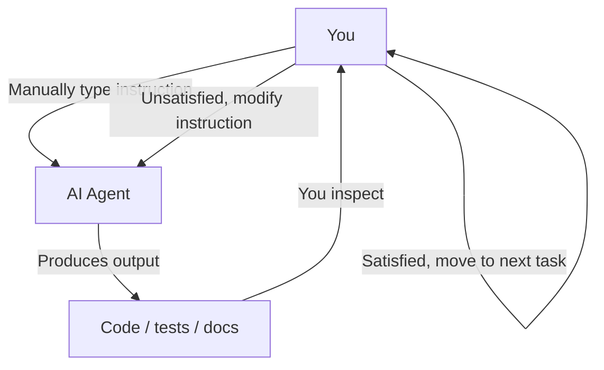
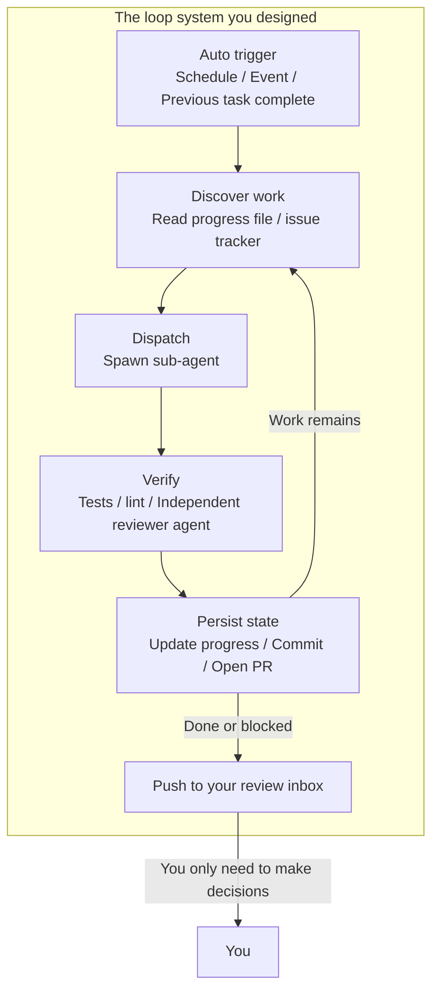
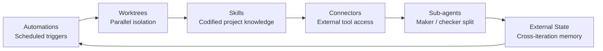
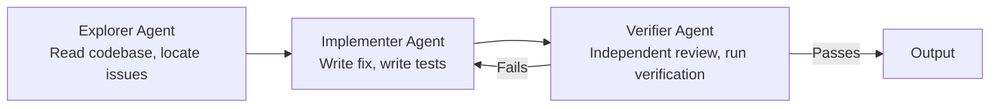
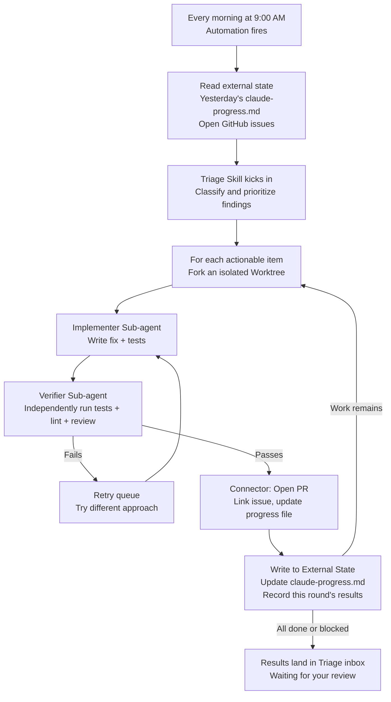
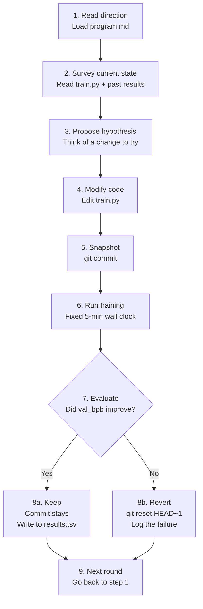

[中文版 →](../../../zh/lectures/lecture-13-loop-engineering/)

> Code examples: [code/](https://github.com/walkinglabs/learn-harness-engineering/blob/main/docs/en/lectures/lecture-13-loop-engineering/code/)
> Practice project: [Project 07. Build Your First Automated Loop](./../../projects/project-07-loop-engineering-first-loop/index.md)

# Lecture 13. From Manual Prompting to Autonomous Loops

Everything you learned in the first twelve lectures rests on one assumption: **you are sitting at the keyboard, typing instructions one at a time.**

You wrote `AGENTS.md` (Lectures 1–4), built state management (Lectures 5–6), constrained scope with feature lists (Lectures 7–8), left clean handoffs at session end (Lectures 9, 12), and made the runtime observable (Lectures 10–11). But the trigger for all of it was always you. The agent never decided on its own when to start working — because no one pressed "start."

This lecture is about handing the start button to the system. Not giving up control — elevating it to the next layer.

## /goal: The Simplest Possible Loop

The best entrance to loop engineering is not a complex architecture diagram — it's a single command.

In early 2026, Claude Code and OpenAI Codex independently shipped the same feature: `/goal`. You type in the terminal:

```
/goal "All tests pass, zero lint warnings, merge to main"
```

Then you close your laptop and go to sleep. Eight hours later, the agent has analyzed, coded, tested, fixed, and merged on its own. It retries on failure, switches approaches when stuck, and stops when done — without you leaning over its shoulder saying "try again."

The only difference between `/goal` and a traditional prompt is one thing. But that one thing changes everything:

| | Traditional Prompt | `/goal` |
|---|---|---|
| What you provide | What to do next | What the end state looks like |
| What the agent does | Execute once | Loop until achieved |
| Who judges done | You | A verifiable stopping condition |
| When you can walk away | You can't | The moment you type `/goal` |

`/goal` is essentially a loop. It has exactly three parts: **a goal, a verification method, and a stopping condition.** Just those three things move you from inside the loop to outside it.

### How `/goal` Grew Organically

`/goal` didn't jump from 0 to 1 out of nowhere. It grew gradually out of everyday workflows, going through roughly four stages:

**Stage 1: Manual one-by-one prompting.** The earliest way of working was back-and-forth: "write a function," "add a test," "fix this logic." The agent stopped after every step and waited for you to say what's next. You were the scheduler of the entire pipeline.

**Stage 2: Long prompts with multiple steps.** Then people started writing longer prompts that stacked steps together: "first analyze the code, then write the implementation, then run tests, and if they fail, fix them." The agent could run several steps in one go, but you still had to watch — because it might drift mid-way, or finish a step and not know what to do next.

**Stage 3: Agent self-reflection and self-direction.** After that, agents gained "introspection" — after each step they'd look at the result and decide what to do next. You gave a goal, and they broke it down themselves and retried on their own. But a problem emerged: when do they stop? Does "I'm done" coming from the agent itself count? Practice kept answering — no. Agents declare victory far too easily.

**Stage 4: Independent stopping judgment — `/goal`.** The final step was taking "judging whether it's done" out of the hands of the agent doing the work, and handing it to an independent judge. It could be a different model, a script, or a test command — but the rule was the same: the person writing the code can't grade their own homework. At this point, `/goal` truly worked: you give the goal, it loops, an independent judge decides when to stop, and you can walk away.

These four stages weren't a roadmap planned by any one company. They were the path everyone coding with agents arrived at, independently, pushed by the same pain points. Claude Code and Codex shipping `/goal` almost simultaneously in early 2026 wasn't a coincidence — the time had come.

### There's More Than One Kind of Loop

`/goal` is the easiest loop to understand, but it's not the only kind. Loops fall into categories based on how they're triggered and how they stop:

| Type | Trigger | Stop Condition | Claude Code | Codex | Best For |
|------|---------|----------------|-------------|-------|----------|
| **Turn-based loop** | You type each prompt manually | Agent thinks it's done, or you interrupt | Normal chat | Normal chat | Small tasks, exploratory work |
| **Goal-based loop** | You give a goal | Independent evaluator confirms done, or max turns reached | `/goal` | `/goal` (manual enable required) | Complex tasks with clear completion criteria |
| **Time-based loop** | Scheduled interval (every N minutes/hours) | You stop it manually, or it exits after completing the work | `/loop` | Thread automation | Polling status, periodic checks, recurring work |
| **Event-driven loop** | External event (PR opened, CI failed, new issue) | Stops after handling the event, or hits retry limit | Routines (API / GitHub Webhook) | Standalone automation + plugins | Reactive workflows, CI/CD integration |

These aren't competing — they're different tools for different jobs. Turn-based is fine for small things. Use `/goal` when there's a clear finish line. Use `/loop` when you need to watch something. Use event-driven when you're integrating with external systems.

### Don't Confuse `/goal` and `/loop`

Both have "loop" in the name, but they solve completely different problems:

| | `/goal` | `/loop` |
|---|---------|---------|
| **What it is** | One big task, runs until it's done | One small action, repeats on an interval |
| **Stop condition** | Goal reached, or budget exhausted | You stop it manually, or the task exits on its own |
| **Time profile** | One long run, can take hours or days | Periodic short bursts, each run may be a few minutes |
| **Progress** | Gets closer to the finish line each iteration | Each run is independent, no cumulative progress |
| **Analogy** | Running a marathon — start gun fires, you stop at the finish line | An alarm clock — rings on a schedule, you turn it off |
| **Typical use** | "Implement the full payment system with test coverage" | "Check if CI is broken every 15 minutes" |

A common mistake: shoving something that should be a `/goal` into a `/loop`. Like writing `/loop 10m "keep implementing the payment system"` — that's wrong. `/loop` runs the same instruction independently each time, it doesn't remember where it left off last time. You'll just get the same starting point over and over.

**One-sentence test for which one to use: does this thing have an end?**
- Has an end → `/goal`
- No end, you just need to keep watching → `/loop`

Loop Engineering, the subject of this lecture, isn't about any one command. It's about **being able to design systems that include all of these types — so your agent can keep working even when you're not there.**

You don't have to type `/goal` every time. But understanding where it came from and why it looks the way it does — that's understanding the core of loop engineering. More complex loops just add parts like scheduling, parallelism, isolation, and memory on top of these same three fundamentals: goal, verification, stopping condition.

## June 2026: Three People Lit the Same Fuse in One Week

In the first week of June 2026, three practitioners building coding agent infrastructure — without comparing notes — said the same thing in different words.

**Peter Steinberger** (creator of OpenClaw, [his post reached 8 million views](https://x.com/steipete/status/2063697162748260627)): "You shouldn't be prompting coding agents anymore. You should be designing loops that prompt your agents."

**Boris Cherny** (head of Claude Code at Anthropic, [on the Acquired podcast](https://x.com/rohanpaul_ai/status/2063289804708835412)): "I don't prompt Claude anymore. I have loops running that prompt Claude and figure out what to do. My job is to write loops."

**Addy Osmani** (engineering lead at Google Chrome) [named the concept](https://addyosmani.com/blog/loop-engineering/) on June 7, 2026, and gave it a one-line definition:

> **Loop engineering is replacing yourself as the person who prompts the agent. You design the system that does it instead.**

Cherny disclosed numbers: over 30 consecutive days, all code contributions to Claude Code were made autonomously by AI — 259 merged PRs, over 80% of production code authored by Claude, and a 76% success rate on open-ended software tasks.

Three people. One week. The same conclusion. Not because they coordinated — because the infrastructure had quietly crossed a threshold. Agents had become reliable enough to finish non-trivial tasks unattended. Scheduling primitives (`/loop`, `/goal`, cron) were now built into the tools. The cost of a single agent run had dropped low enough that running one repeatedly on a timer stopped looking wasteful. When all the parts are present, the move that combines them becomes obvious to everyone at once.

> Source: [Addy Osmani: Loop Engineering](https://addyosmani.com/blog/loop-engineering/)

## Inside the Loop vs. Outside the Loop

Let's contrast two concrete scenarios.

**Scenario A: You are inside the loop (Lectures 1–12).**



You have a complete harness: `AGENTS.md` tells the agent the project rules, `feature_list.json` constrains scope, `init.sh` ensures consistent environment, `claude-progress.md` records progress. **But every step still requires your manual initiation.** Finish one feature, read the progress file, think about what's next, type the instruction. You are the engine of the entire workflow.

**Scenario B: You are outside the loop (Loop Engineering).**



You don't type instructions anymore. The system you designed discovers the work, dispatches it, verifies the results, records the state, and decides the next step. Your job shrinks to three things: **define the goal and stopping condition before it starts, review the output after it finishes, and adjust the rules when the system veers off course.** The leverage moves from "writing the right prompt" to "designing the right loop."

> Osmani: "A year ago if you wanted a loop you wrote a pile of bash and you maintained that pile forever and it was yours and only yours. Now the pieces just ship inside the products." You don't need to build from scratch. You need to understand how the pieces fit together.

## Core Concepts

- **Loop Engineering**: Designing a system that automatically prompts your agent, replacing manual step-by-step human input. The human moves from inside the loop to outside it, and the leverage shifts from "writing the right prompt" to "designing the right loop."
- **`/goal` mode**: The simplest possible loop — provide a goal, verification method, and stopping condition; the agent loops until met. The bridge from manual prompting to autonomous loops.
- **Generator/Evaluator Separation**: The agent that writes the code and the agent that checks it must be separated. A model grading its own work is untrustworthy; an independent verifier — sometimes using a different model entirely — is the baseline reliability guarantee of any loop.
- **Worktree Isolation**: Each parallel agent works in an independent git worktree, physically preventing file collisions. The infrastructure prerequisite for multi-agent parallel execution.
- **External State**: Memory that lives outside a single conversation — markdown files, issue trackers, kanban boards. Models forget everything between runs; memory must live on disk.
- **Four Silent Costs**: Four hidden costs that grow sharper the longer a loop runs — verification debt, comprehension rot, cognitive surrender, token blowout. Loops accelerate not just output, but risk.

## The Six Primitives of a Loop

Osmani decomposed a loop into five core building blocks, plus one memory layer that threads through all of them — six things in total, but the memory layer occupies a special status: it's not a component on the same level as the others; it's the spine that everything else depends on.

The diagram below draws all six as a ring so you can see the full picture at a glance. But remember: External State isn't just another stop on the loop — it's the foundation the whole loop rests on.



### 1. Automations — The Heartbeat

Without automation, a loop isn't a loop — it's a one-off run you did manually.

Both Claude Code and Codex have full scheduling systems, but they use different names and layers. Roughly mapping from lightest to heaviest:

| Layer | Claude Code | Codex | Notes |
|-------|-------------|-------|-------|
| In-session polling | `/loop` | Thread automation | Tied to current session, dies when session closes |
| Local scheduled tasks | Desktop scheduled tasks | Standalone automation (local mode) | Runs while machine is on, can access local files |
| Cloud scheduled tasks | Cloud Routines | — (no native cloud scheduler) | Runs while machine is off |
| Event triggers | Routines (API / GitHub Webhook) | Standalone automation + plugins | Triggered by external events |
| Fully self-hosted | GitHub Actions / self-hosted cron | `codex exec` + cron | Full control |

**Codex's Automations tab** is the scheduling entry point. Pick the project, the prompt, the cadence, and whether it runs on your local checkout or a background worktree. Runs that find something land in a Triage inbox; runs that find nothing auto-archive. OpenAI uses them internally for daily issue triage, CI failure summaries, commit briefings, and hunting for bugs introduced last week.

Codex automations come in two flavors:
- **Thread automation** — Heartbeat-style recurring wake-up calls attached to a thread, preserving context. Good for continuous follow-up on a single thing, like monitoring a long-running command or polling PR status. The equivalent in Claude Code is `/loop`.
- **Standalone automation** — Each run starts fresh, results go to Triage. Good for daily/weekly independent tasks like briefings or dependency scans. The equivalent in Claude Code is Desktop scheduled tasks.

Claude Code's system is layered more granularly:

- **`/loop`** — Lightweight in-session scheduled repetition. Works while your terminal is open, dies when the session closes, auto-expires after 7 days. Good for temporary monitoring during your current work session.
- **Desktop scheduled tasks** — Runs while your machine is on, survives session restarts, minute-level intervals. Good for recurring work that needs local file access.
- **Cloud Routines** — Runs on Anthropic's cloud infrastructure, survives your machine being off, 1-hour minimum interval. Supports three trigger types: scheduled, API call, GitHub webhook. Good for daily tasks that don't need your local environment.
- **GitHub Actions / self-hosted cron** — Fully under your control, runs however you want. Good for scenarios with special environment or security requirements.

```bash
# Claude Code: run tests every 30 min, fix failures (within current session)
/loop 30m Run the test suite and fix any failing tests

# Claude Code: check deploy status every 15 minutes
/loop 15m Check if the production deploy succeeded and report status
```

Automations are the heartbeat. Without them, the loop is a blueprint that never wakes up.

### 2. Worktrees — Isolation at Scale

As soon as you run more than one agent, file collisions become the inevitable failure mode. Two agents writing to the same file is exactly the headache of two engineers committing to the same lines without consulting each other.

`git worktree` solves this: each agent works on its own branch in its own directory. They physically cannot touch each other's checkout.

Claude Code and Codex both ship worktree support. When you use `--worktree` or `isolation: worktree` on a sub-agent, each helper gets a clean, independent checkout that cleans up after itself. Worktrees remove the mechanical collision problem — but remember: **your review bandwidth is still the ceiling.** How many parallel agents you can supervise determines how many worktrees you can actually run.

### 3. Skills — Stop Re-Explaining Your Project

A skill is how you stop re-explaining the same project context every session. It's a folder containing a `SKILL.md` with instructions and metadata, plus optional scripts, references, and assets.

Codex and Claude Code support the same format. Skills are invoked directly with `/skill-name` (Codex also supports `$skill-name`), or triggered implicitly when the task matches the skill description.

Skills are fundamentally about paying your intent debt. An agent starts every session cold — it fills any gap in your intent with a confident guess. A skill is that intent written down on the outside: the conventions, the build steps, the "we don't do it this way because of that one incident" — written once, read every run.

### 4. Connectors — Your Loop Touches Real Tools

A loop that can only see the filesystem is a small loop. Connectors (built on the MCP protocol) let the agent read your issue tracker, query a database, hit a staging API, drop a message in Slack.

Codex and Claude Code both speak MCP, so the connector you wrote for one usually works in the other. Connectors are the difference between "here is the fix" and a loop that opens the PR, links the Linear ticket, and pings the channel once CI is green — by itself, inside your actual environment, not just in a terminal.

### 5. Sub-agents — Keep the Maker Away from the Checker

The most structurally valuable design choice in a loop is splitting the one who writes from the one who checks. The model that wrote the code is way too generous grading its own homework. A second agent, with different instructions and sometimes a different model, catches what the first agent talked itself into.

The classic three-role split:



Claude Code's `/goal` runs this under the hood — a fresh, independent session judges whether the loop should stop, not the session that did the work. This is called **generator/evaluator separation**, and it is the single most important reliability guarantee in loop design.

### 6. External State — The Loop's Memory

Models forget everything between runs. Memory must live on disk, not in the context window.

This sounds too simple to matter, but it's the same trick every long-running agent depends on. A markdown file, a Linear board — anything that lives outside a single conversation and holds what is done, what is in progress, and what is next. The agent forgets. The repository doesn't.

These six primitives are your loop design toolkit. You don't need all of them for every loop. But you need to know when to reach for which one.

## A Complete Loop, Anatomized

Wire all six together and here's what a real morning triage loop looks like:



This is no longer a single agent run. It is a continuously operating system that wakes up every morning, sweeps the floor on its own, and puts the things that need your attention in front of you. Your role becomes: **review the inbox contents, make decisions, and when you spot a pattern the system can't handle, refine the skills and rules.**

Cherny used this pattern to merge 259 PRs in 30 days without opening an IDE once. OpenAI engineers used the same pattern to build a roughly one-million-line beta product by hand — without writing a single line of code themselves.

## Generator/Evaluator Separation: Why You Can't Let the Model Grade Its Own Work

This is the hardest lesson in loop engineering.

Your smartest agent writes a beautiful piece of code. The logic is clear, the comments are thorough, and every function has a test. You are satisfied.

But here's the question: **if you let the agent that wrote that code judge whether it did a good job, what will it say?**

The answer has been confirmed by experience again and again: it will give itself a high score. Not because it's dishonest, but because it is the author — it convinced itself this path was correct during generation. When it looks back, it doesn't see mistakes; it sees its own reasoning process.

This is not a Claude problem. This is not a GPT problem. This is a property of all generative models. **A model is its own output's best defense attorney.**

The fix: never let the same entity (same model, same prompt) do both the work and the review.

- Claude Code's `/goal` uses an independent supervisor session to judge whether the goal is met — not the session that attempted it.
- Codex's sub-agent system lets you define a verifier agent using a different model with different reasoning effort.
- The community practice of "adversarial verify" spawns N independent skeptics per finding, each prompted to refute — majority rejection kills the finding.

One sentence to remember: **someone in your crew must not believe you.**

## Karpathy's autoresearch: The Loop Exemplar

If you want to see what a well-designed, actually-running loop looks like, [Karpathy's autoresearch](https://github.com/karpathy/autoresearch) is the textbook example.

In March 2026, Karpathy released a 630-line Python project. Give it one GPU and a research direction, and it runs all night — completing hundreds of ML training experiments, keeping only the ones that truly improve. The project hit 66,000+ stars within days of release.

### Three Files, Three Roles

The whole system has just three core files, but the division of labor is razor-sharp:

| File | Who Edits It | What It Does |
|------|-------------|-------------|
| `prepare.py` | Nobody (read-only) | Data prep, tokenizer, eval harness. Fixed infrastructure. |
| `train.py` (~630 lines) | **AI Agent** | Model definition, optimizer, training loop. The agent's playground — change anything. |
| `program.md` | **You** | Research methodology written in natural language. You only edit this. Tell the agent how to explore, how to evaluate, what not to touch. |

This three-way split is the soul of the design: **humans don't touch code, they touch direction; agents don't touch direction, they touch code.** Your job shifts from writing Python to "writing the research org culture."

### Input: What program.md Looks Like

`program.md` is the brain of the loop. It's not code — it's a research instruction manual written in Markdown. It roughly contains:

- **Goal**: optimize `val_bpb` (validation bits per byte, lower is better)
- **Constraints**: don't touch `prepare.py`, stay within VRAM budget, fixed 5-minute training
- **Exploration directions**: try different architectures, optimizers, LR schedules
- **Evaluation rules**: what counts as improvement, how to log results, what to do on failure
- **Iron rule**: never stop. Once the loop starts, keep going forever

Your kickoff prompt to the agent can be as short as one sentence:

```
Have a look at program.md and let's kick off a new experiment!
```

The rest is up to the agent reading the doc and making its own decisions.

### The Nine-Step Ratchet Loop

At the heart of autoresearch is a **ratchet** — it only moves forward, never backward. Each iteration strictly follows nine steps:



It runs roughly 12 experiments per hour. An overnight run (8 hours) is about 100 experiments. Karpathy himself ran it for 2 days — ~700 experiments.

The fixed 5-minute wall-clock budget is a key design choice — no matter what the agent changes, every experiment takes exactly the same time. This means all results are directly comparable under the same time budget — no argument about "this one ran longer so it's better."

### Output: What You See When You Wake Up

After a night of looping, you sit down in the morning and find three things:

**1. Git history (the forward-moving ratchet)**

Only commits that actually improved stay on the main branch. Everything that failed was rolled back. `git log` is a validated research log.

**2. results.tsv (the full experiment record)**

Every single experiment — success or failure — is logged:

```
timestamp    commit_hash    val_bpb    vram_mb    description
--------- ------------- ---------- ---------- ----------------------------
08:01:12  a1b2c3d       1.234     22100    baseline
08:06:15  d4e5f6g       1.228     22400    increased learning rate by 10%
08:11:20  (reverted)     1.241     21800    switched to GELU activation
08:16:08  h7i8j9k       1.219     23000    added weight decay 0.01
...
```

**3. A research log (agent's own summary)**

The agent writes clear commit messages about what it tried, what worked, what didn't, and what it plans to try next. You read those — you don't have to read the code diffs.

### What It Actually Found

Results from Karpathy's initial 2-day, ~700-experiment run:

- Out of ~700 attempts, about **20 stackable real improvements** were found
- Reduced nanochat's GPT-2-level training time on 8×H100 from **2.02 hours → 1.80 hours**, about **11% faster**
- Findings included: learning rate adjustments, optimizer tuning, activation swaps, attention pattern optimizations, etc.

Were all improvements earth-shattering discoveries? No. Most were small optimizations that stacked. But those 20 valid improvements would have taken a human researcher weeks of manual work — the agent did it in 48 hours.

### The Most Telling Detail: The Loop Is Written in English, Not Code.

`program.md` is a Markdown document, not a Python script. It describes a research methodology — what to modify, what to leave alone, how to evaluate, how to handle failure cases, and one iron rule: **never ask for human help, just keep going.** A coding agent reads this document and executes it indefinitely.

This is the template for loop engineering: don't give the agent a task. Give it a **methodology**. Let the methodology be the loop. One `program.md`, 630 lines of glue code, and everything else is the agent running itself.

## Four Silent Costs

When a loop starts running, you won't see the problems immediately. The following four costs accumulate silently, and by the time you notice, you may have already paid heavily.

### 1. Verification Debt

Fast loops tempt you to skip verification. "Looks fine" is not the same as "confirmed correct." The more code a loop generates unattended, the faster verification debt piles up. The fix: **stopping conditions must be machine-checkable, never "feels about right."**

### 2. Comprehension Rot

The faster a loop ships code, the further your understanding of your own codebase drifts from reality. Cherny's team had 80% of code authored by agents — meaning most of a team's code wasn't written by a person. If you don't read and use what the loop produces, your comprehension decays continuously. **Fast loops require fast reading.**

### 3. Cognitive Surrender

When the loop runs smoothly, the most comfortable posture is to stop having opinions. Take whatever it gives back, don't think about the output. But that is exactly where danger begins — you're using the loop to avoid thinking, rather than to amplify thinking. Osmani's warning: "Two people can build the exact same loop and get opposite results. One uses it to go faster on work they understand; the other uses it to avoid understanding the work. The loop doesn't know the difference. You do."

### 4. Token Blowout

Every iteration of a loop accumulates more context: code written, errors encountered, decisions made. Without context management, prompt size grows roughly quadratically with the number of turns. Codex addresses this with automatic context compaction — a dedicated API compresses older conversation turns into encrypted content summaries, retaining essential knowledge while discarding redundant detail. This is an engineering concern you must address from the first loop, not a bolt-on later.

## Building Your First Loop

You don't need to start with a Stripe-scale pipeline merging 1,300 PRs a week. Start with the smallest thing that works.

### Step 1: Pick One Recurring Task

Find something you do manually at least twice a week. Examples:
- Open GitHub in the morning, check new issues, triage and respond
- Run lint and tests before every PR review
- Update progress docs at the end of each day

### Step 2: Write a Goal and Stopping Condition

Turn the task into something a `/goal` can understand:

```markdown
Goal: Check the 10 most recent issues in the repo.
For each issue:
  - If it already has clear labels and an assignee, skip
  - If untagged, add appropriate labels based on content
  - If fixable in under 10 minutes, create a branch and attempt a fix
Stop when: All qualifying issues have been processed, or an issue requires human decision.
```

### Step 3: Split Maker and Checker

Don't let the same agent both write the code and judge it. Split your loop into two roles:
- Implementer: reads the issue, writes the fix, writes the tests
- Verifier: independently runs tests, reviews the diff, judges whether the fix actually solves the problem

### Step 4: Add Memory

Use a markdown file to record what happened in each loop run. The next run starts by reading this file — it knows what was done, what's pending, what was blocked. This beats any complex database.

### Step 5: Set a Timer

Use `/loop` or your OS cron to let the loop start without you. Begin with once a day. Observe for a week.

### The Maturity Ladder

You don't need to reach the top in one jump. Loop adoption is a ladder:

1. **Level 1: Goal Runner** — You can use `/goal` to give a task with a stopping condition; the agent loops until met.
2. **Level 2: Scheduled Single-Task** — One automation runs one task on a timer (e.g., morning CI check).
3. **Level 3: Multi-Agent Loop** — Maker and checker split; each finding forks an isolated worktree.
4. **Level 4: Self-Feeding Loop** — The loop auto-discovers its next task from external state; it decides what to do next.
5. **Level 5: Fleet Orchestration** — Multiple loops run in parallel, independent but sharing a memory layer.

Most teams are currently between Level 2 and Level 3. Level 1 is the fastest path to seeing returns.

## Key Takeaways

- **Loop Engineering does not replace Harness Engineering — it builds one floor above it.** The harness makes single runs reliable. The loop makes continuous runs autonomous.
- **`/goal` is the simplest possible loop:** goal + verification + stopping condition. Those three things move you from inside the loop to outside it.
- **Six primitives (Automations / Worktrees / Skills / Connectors / Sub-agents / External State) are the loop's building blocks.** Not all of them every time, but you need to know when to reach for which.
- **The maker and the checker must be separated.** A model grading its own work is untrustworthy. An independent verifier — sometimes a different model altogether — is the baseline reliability guarantee of any loop.
- **Loops make generation nearly free and leave judgment as the scarce resource.** The time you save isn't for resting. It's for making more judgments.
- **Four silent costs grow sharper as loops run longer:** verification debt, comprehension rot, cognitive surrender, token blowout. Loops accelerate output — and risk.
- **Start small.** One `/goal`, one cron, one markdown memory file. See the return, then stack upward.

## Further Reading

- [Addy Osmani: Loop Engineering](https://addyosmani.com/blog/loop-engineering/)
- [Addy Osmani: Agent Harness Engineering](https://addyosmani.com/blog/agent-harness-engineering/)
- [Simon Willison: Designing Agentic Loops (Sep 2025)](https://simonw.substack.com/p/designing-agentic-loops)
- [Karpathy: autoresearch](https://github.com/karpathy/autoresearch)
- [Claude Code: Dynamic Workflows and Orchestration](https://kenhuangus.substack.com/p/claude-code-orchestration-dynamic)
- [Loop Library (Forward Future)](https://signals.forwardfuture.ai/loop-library/) — Public corpus of 50 real loops
- [The Neuron: Claude Code Creators on Agent Loops](https://www.theneuron.ai/explainer-articles/claude-code-creators-boris-cherny-and-cat-wu-explain-how-to-use-agent-loops/)
- Lecture 12: [Leave a Clean Handoff at the End of Every Session](./../lecture-12-why-every-session-must-leave-a-clean-state/index.md) — The prerequisite for loops: each session leaves clean state so the next round can auto-start
- Lecture 5: [Keep Long-Running Tasks Continuous Across Sessions](./../lecture-05-why-long-running-tasks-lose-continuity/index.md) — Prerequisite knowledge for external state and memory
- Lecture 11: [Why Observability Belongs Inside the Harness](./../lecture-11-why-observability-belongs-inside-the-harness/index.md) — The faster a loop runs, the more you need observability to catch problems
- Lecture 8: [Why Feature Lists Are Harness Primitives](./../lecture-08-why-feature-lists-are-harness-primitives/index.md) — Feature lists are the natural data source for a self-feeding loop to discover its next task

## Exercises

1. **Turn a recurring task into a `/goal`:** Find something you manually do at least twice a week. Write down its goal, verification method, and stopping condition. Run it once with `/goal` and compare the time and quality against doing it manually. This is your first step from Harness to Loop.

2. **Separate maker and checker:** Pick a task you've previously had an agent execute. This time, write two different prompts: one for the implementer agent and one for the verifier agent (use different models — e.g., Claude for implementation, GPT for verification, or vice versa). The verifier must point out specific issues with cited evidence. Record the number and type of issues found in each mode.

3. **Give your loop a memory:** Create a markdown state file for your loop. In each iteration, write: what was done this round, verification results, status (pass/fail/blocked), and what to do next. Run three rounds and observe the behavioral difference between having and not having a memory file.

4. **Audit your loop's silent costs:** After your loop has run for an hour, assess these four metrics:
   - How much verification was "feels right" rather than "machine-confirmed"? (Verification debt)
   - How well can you explain the code your loop most recently produced? (Comprehension rot)
   - How many times did you think "I'll look later" and never looked? (Cognitive surrender)
   - How is the loop's context size trending? Is it repeating redundant information? (Token blowout)
