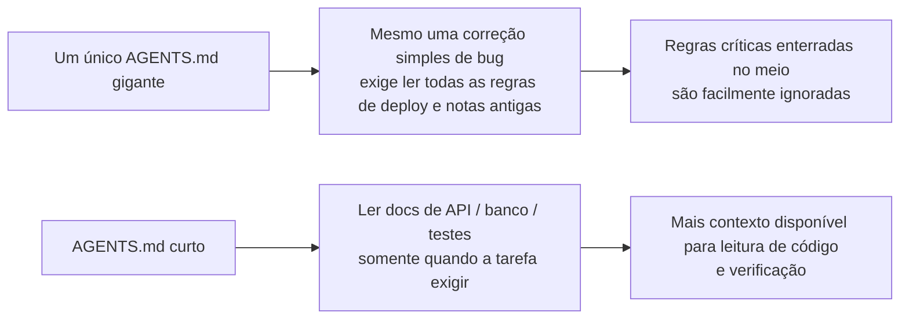
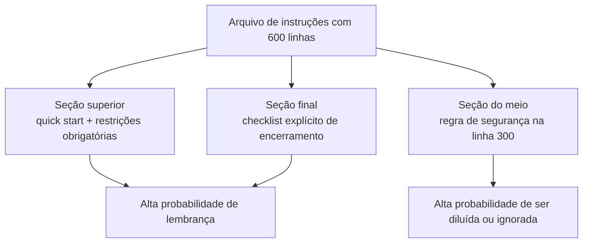

[中文版 →](../../../zh/lectures/lecture-04-why-one-giant-instruction-file-fails/)

> Exemplos de código: [code/](https://github.com/walkinglabs/learn-harness-engineering/blob/main/docs/pt-BR/lectures/lecture-04-why-one-giant-instruction-file-fails/code/)
> Projeto prático: [Projeto 02. Workspace legível para agentes](./../../projects/project-02-agent-readable-workspace/index.md)

# Aula 04. Divida as Instruções em Múltiplos Arquivos

Você começou a levar harness engineering a sério — ótimo. Criou um `AGENTS.md` e colocou nele toda regra, restrição e lição aprendida que conseguiu imaginar. Um mês depois o arquivo tinha crescido para 300 linhas, dois meses depois 450, três meses depois 600. Então você percebe que a performance do agente está piorando: em uma simples correção de bug, o agente consome enormes quantidades de contexto processando instruções irrelevantes de deploy; uma restrição crítica de segurança escondida na linha 300 é completamente ignorada; três regras contraditórias de estilo de código fazem o agente escolher uma aleatoriamente a cada execução.

Essa é a armadilha do “arquivo gigante de instruções”. Tudo parece importante, então você coloca tudo no mesmo lugar, e encontrar uma regra específica passa a exigir percorrer o arquivo inteiro. Você escreveu 600 linhas, mas apenas um terço delas realmente é relevante para a tarefa atual.

## O Ciclo Vicioso na Raiz do Problema

O ciclo vicioso mais comum funciona assim: o agente comete um erro, você pensa “vou adicionar uma regra para evitar isso”, adiciona ao `AGENTS.md`, e funciona — temporariamente. Depois o agente comete outro erro, então você adiciona mais uma regra. Repita isso até o arquivo ficar descontroladamente inchado.

Essa reação é completamente natural. “Adicionar uma regra” sempre que algo dá errado parece razoável. Mas o efeito acumulado é desastroso. Vamos olhar exatamente o que acontece.

**O orçamento de contexto é consumido rapidamente.** A janela de contexto do agente é finita. Imagine um agente com 200K tokens de contexto (padrão do Claude). Um arquivo de instruções inchado pode consumir entre 10K e 20K tokens. Parece que ainda sobra muito espaço? Mas uma tarefa complexa pode exigir leitura de dezenas de arquivos-fonte, a saída de ferramentas também ocupa contexto, e o histórico da conversa continua crescendo. Quando o agente finalmente precisa entender o código, o orçamento já foi praticamente consumido.

**Lost in the Middle.** O paper *Lost in the Middle* (Liu et al., 2023) demonstrou claramente que LLMs utilizam informações localizadas no meio de textos longos de forma muito menos eficiente do que informações no início ou no fim. Seu `AGENTS.md` tem 600 linhas, e a linha 300 diz “todas as queries ao banco devem usar queries parametrizadas” — uma restrição crítica de segurança. Mas ela está enterrada no meio do arquivo, e o agente provavelmente irá ignorá-la.

**Conflitos de prioridade.** O arquivo mistura restrições obrigatórias (“nunca use eval()”), diretrizes importantes de design (“prefira estilo funcional”) e lições históricas específicas (“corrigimos um vazamento de memória em WebSocket na semana passada, fique atento a padrões parecidos”). Essas três regras têm níveis de importância completamente diferentes, mas no arquivo elas parecem idênticas. O agente não possui um sinal confiável para distinguir o que é uma linha vermelha do que é apenas uma recomendação.

**Decadência de manutenção.** Arquivos grandes são naturalmente difíceis de manter. Instruções desatualizadas raramente são removidas, porque as consequências da remoção são incertas (“talvez algo dependa dessa regra?”), enquanto adicionar novas instruções parece não ter custo. Resultado: o arquivo apenas cresce, nunca diminui, e a relação sinal/ruído piora continuamente. É exatamente o mesmo problema do acúmulo de dívida técnica em software.

**Acúmulo de contradições.** Instruções adicionadas em momentos diferentes começam a se contradizer — uma diz “use TypeScript strict mode”, outra diz “alguns arquivos legados podem usar any”. O agente escolhe uma delas aleatoriamente a cada execução.

## Conceitos Principais

- **Instruction Bloat**: Quando um arquivo de instruções ocupa entre 10% e 15% da janela de contexto, ele começa a competir diretamente com o orçamento necessário para leitura de código e raciocínio sobre a tarefa. Um `AGENTS.md` de 600 linhas pode consumir entre 10.000 e 20.000 tokens — algo entre 8% e 15% de uma janela de 128K.

- **Lost in the Middle**: Informações no meio de textos longos são facilmente ignoradas. A pesquisa de Liu et al. (2023) mostrou que LLMs utilizam informações localizadas no meio de textos longos de forma significativamente menos eficiente do que informações no início ou no fim. Uma restrição crítica escondida na linha 300 de um arquivo com 600 linhas tem alta probabilidade de ser ignorada.

- **Instruction Signal-to-Noise Ratio (SNR)**: A proporção entre instruções relevantes e irrelevantes para a tarefa atual. Ser obrigado a ler 50 linhas de instruções de deploy durante uma correção simples de bug — isso é baixo SNR.

- **Entry File**: Um arquivo de entrada curto cujo objetivo é direcionar o agente para documentações mais detalhadas, em vez de conter tudo dentro dele mesmo. Algo entre 50 e 200 linhas é suficiente.

- **Reveal on Demand**: Primeiro entregue informações de visão geral; detalhes somente quando necessário. Um bom harness é como um bom design de interface — não despeje todas as opções de uma vez no usuário.

- **Can't Tell What Matters**: Quando todas as instruções aparecem no mesmo formato e localização, o agente não consegue distinguir restrições obrigatórias de recomendações opcionais.

## Arquitetura de Instruções





## Como Dividir

Princípio central: mantenha informações frequentemente necessárias sempre acessíveis, esconda informações ocasionalmente necessárias em locais apropriados, e não carregue aquilo que nunca será usado.

O arquivo de entrada `AGENTS.md` deve permanecer entre 50 e 200 linhas, contendo apenas os itens mais essenciais:

- visão geral do projeto (uma ou duas frases deixando claro o que é o projeto)
- comandos de primeira execução (`make setup && make test`)
- restrições globais obrigatórias (no máximo 15 regras inegociáveis)
- links para documentos temáticos (descrição em uma linha + condição de aplicabilidade)

```markdown
# AGENTS.md

## Visão Geral do Projeto
Backend em FastAPI com Python 3.11 e banco de dados PostgreSQL 15.

## Início Rápido
- Instalação: `make setup`
- Testes: `make test`
- Verificação completa: `make check`

## Restrições Obrigatórias
- Todas as APIs devem utilizar autenticação OAuth 2.0
- Todas as queries ao banco devem utilizar sintaxe do SQLAlchemy 2.0
- Todos os PRs devem passar em `pytest` + `mypy --strict` + `ruff check`

## Documentos Temáticos
- Padrões de Design de API (`docs/api-patterns.md`) — Leitura obrigatória ao adicionar endpoints
- Regras de Banco de Dados (`docs/database-rules.md`) — Obrigatório ao modificar operações de banco
- Padrões de Teste (`docs/testing-standards.md`) — Referência ao escrever testes
```

Cada documento de tópico deve ter entre 50 e 150 linhas, organizado por assunto dentro do diretório `docs/` ou ao lado do módulo correspondente. O agente só lê esses documentos quando necessário. Pense nisso como organizadores de mala — roupas íntimas em um compartimento, itens de higiene em outro, carregadores em um terceiro. Encontrar o que você precisa não exige esvaziar a mala inteira.

Algumas informações funcionam melhor diretamente no código — definições de tipos, comentários de interface, explicações em arquivos de configuração. O agente naturalmente vê isso ao ler o código, então não há necessidade de duplicar essas informações nas instruções.

Toda instrução deve documentar sua origem (“por que essa regra foi adicionada?”), condição de aplicabilidade (“quando essa regra é necessária?”) e condição de expiração (“em quais circunstâncias essa regra pode ser removida?”). Faça auditorias regularmente e remova entradas desatualizadas, redundantes ou contraditórias. Gerencie suas instruções da mesma forma que gerencia dependências de código — dependências não utilizadas devem ser removidas, caso contrário elas apenas tornam o sistema mais lento.

Se uma instrução realmente precisar ficar no arquivo de entrada, coloque-a no topo ou no final, nunca no meio. O efeito “lost in the middle” nos mostra que LLMs utilizam informações nas extremidades de textos longos de forma significativamente melhor do que informações no centro. Mas a melhor abordagem é mover as instruções para documentos de tópico carregados sob demanda.

Tanto a OpenAI quanto a Anthropic apoiam implicitamente essa abordagem de divisão. A OpenAI diz que arquivos de entrada devem ser “curtos e orientados a roteamento”, enquanto a Anthropic afirma que informações de controle para agentes de longa duração devem ser “concisas e de alta prioridade”. Ambas estão dizendo a mesma coisa: não coloque tudo em um único arquivo.

## Exemplo do Mundo Real

O `AGENTS.md` de um time SaaS cresceu de 50 para 600 linhas. O conteúdo misturava versões da stack tecnológica, padrões de código, notas históricas sobre bugs, guias de uso de APIs, procedimentos de deploy e preferências pessoais de membros da equipe — tudo estava lá, mas encontrar a parte relevante para a tarefa atual era cansativo.

O desempenho do agente começou a piorar visivelmente: durante correções simples de bugs, o agente gastava muito contexto processando instruções irrelevantes de deploy; a restrição de segurança “todas as queries de banco devem usar parameterized queries” estava enterrada na linha 300 e frequentemente era ignorada; três regras contraditórias de estilo de código faziam o agente escolher uma aleatoriamente.

A equipe executou uma refatoração dividindo as instruções:

1. `AGENTS.md` reduzido para 80 linhas: apenas visão geral do projeto, comandos de execução e 15 restrições globais obrigatórias
2. Criação de documentos por tópico: `docs/api-patterns.md` (120 linhas), `docs/database-rules.md` (60 linhas), `docs/testing-standards.md` (80 linhas)
3. Inclusão de links para os documentos de tópico no arquivo de entrada
4. Notas históricas foram convertidas em casos de teste ou removidas completamente

Após a refatoração: a taxa de sucesso no mesmo conjunto de tarefas subiu de 45% para 72%. A conformidade com as restrições de segurança aumentou de 60% para 95%, porque a regra saiu do meio do arquivo e foi movida para o topo do arquivo de entrada — deixando de ficar “perdida no meio”.

## Principais Conclusões

* “Adicionar uma regra” é um alívio de curto prazo e um veneno de longo prazo. Antes de adicionar qualquer regra, avalie se ela deveria estar em um documento de tópico.
* O arquivo de entrada é um roteador, não uma enciclopédia. 50–200 linhas — apenas visão geral, restrições obrigatórias e links.
* Aproveite o efeito “lost in the middle”: coloque informações importantes no topo ou no final e mova itens menos críticos para documentos de tópico.
* Gerencie o crescimento das instruções da mesma forma que gerencia dívida técnica. Faça auditorias regulares, e toda instrução deve ter uma origem, condição de aplicabilidade e condição de expiração.
* Após dividir as instruções, o SNR melhora e o agente passa a gastar mais do orçamento de contexto na tarefa real em vez de processar instruções irrelevantes.

## Leitura Complementar

* [OpenAI: Harness Engineering](https://openai.com/index/harness-engineering/)
* [Anthropic: Effective Harnesses for Long-Running Agents](https://www.anthropic.com/engineering/effective-harnesses-for-long-running-agents)
* [Lost in the Middle: How Language Models Use Long Contexts](https://arxiv.org/abs/2307.03172)
* [HumanLayer: Harness Engineering for Coding Agents](https://humanlayer.dev/articles/harness-engineering-for-coding-agents/)
* [Nielsen Norman Group: Progressive Disclosure](https://www.nngroup.com/articles/progressive-disclosure/)

## Exercícios

1. **Auditoria de SNR**: Pegue seu arquivo atual de instruções de entrada e liste todas as instruções existentes. Escolha 5 tipos comuns de tarefa e marque se cada instrução é relevante para aquela tarefa. Calcule o SNR para cada tipo de tarefa. Instruções que são ruído para a maioria das tarefas devem ser movidas para documentos de tópico.

2. **Refatoração Reveal on Demand**: Se você possui um arquivo de instruções com mais de 300 linhas, divida-o em: (a) um arquivo de entrada com menos de 100 linhas, (b) entre 3 e 5 documentos de tópico. Execute o mesmo conjunto de tarefas (pelo menos 5) antes e depois da refatoração e compare as taxas de sucesso.

3. **Verificação do Lost in the Middle**: Em um arquivo longo de instruções, coloque uma restrição crítica no topo, no meio e no final, executando o mesmo conjunto de tarefas em cada caso (pelo menos 5 execuções por posição). Veja se existe diferença na taxa de conformidade. Você pode se surpreender com o quão forte é o efeito da posição.