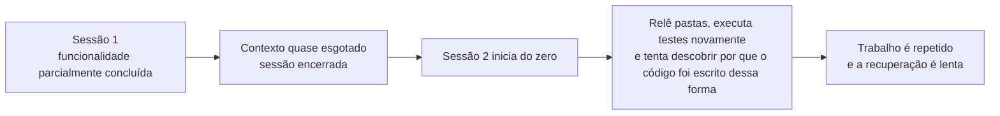
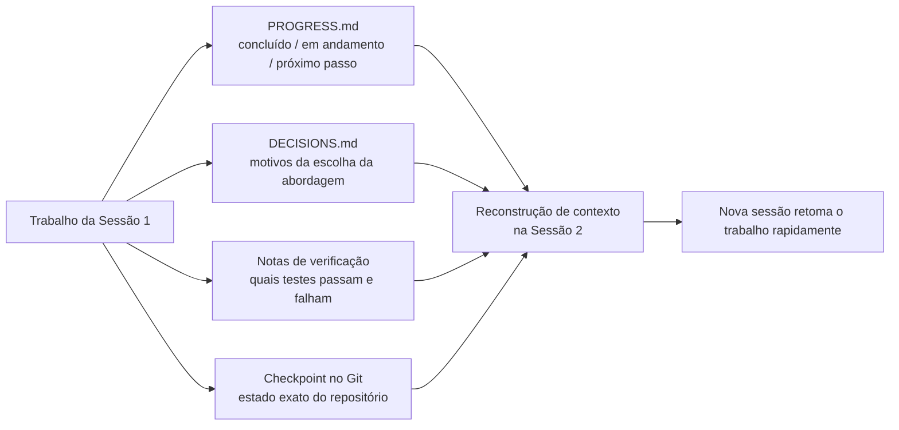

[中文版 →](../../../zh/lectures/lecture-05-why-long-running-tasks-lose-continuity/)

> Exemplos de código: [code/](https://github.com/walkinglabs/learn-harness-engineering/blob/main/docs/pt-BR/lectures/lecture-05-why-long-running-tasks-lose-continuity/code/)
> Projeto prático: [Projeto 03. Continuidade entre múltiplas sessões](./../../projects/project-03-multi-session-continuity/index.md)

# Aula 05. Mantendo o Contexto Vivo Entre Sessões

Você pede ao Claude Code para implementar uma funcionalidade completa. Ele trabalha por 30 minutos, realiza a maior parte da tarefa, mas o contexto está se esgotando. Você inicia uma nova sessão para continuar — e descobre que ele não se lembra das decisões tomadas anteriormente, por que a opção A foi escolhida em vez da opção B, quais arquivos já foram modificados ou em que estado os testes se encontram. Ele gasta mais 15 minutos explorando novamente o projeto e pode até seguir uma abordagem diferente da utilizada anteriormente.

Esse é o dilema real que agentes de IA enfrentam em tarefas que se estendem por múltiplas sessões. Nesta aula, veremos por que os agentes "perdem o fio da meada" durante tarefas longas e como a persistência estruturada de estado permite que uma nova sessão retome rapidamente o trabalho de onde a anterior parou.

## Janelas de Contexto Não São Infinitas

As janelas de contexto são finitas. Esse não é um problema que será resolvido apenas com a evolução dos modelos — mesmo que o tamanho das janelas cresça para 1 milhão de tokens, tarefas complexas continuarão sendo capazes de esgotá-las. Os agentes não apenas geram código; eles também precisam compreender bases de código, acompanhar seu próprio histórico de decisões, processar saídas de ferramentas e manter o contexto da conversa. Toda essa informação cresce mais rápido do que a expansão das janelas de contexto.

Existe um problema ainda mais profundo: as informações produzidas pelos agentes não possuem a mesma importância. Os passos intermediários de raciocínio contêm o **"porquê"** das decisões — por que a opção A foi escolhida em vez da B, por que determinada biblioteca foi selecionada, por que uma otimização específica foi descartada. O resultado final contém apenas o **"o quê"** — o código em si. Estratégias de compactação normalmente preservam o segundo, mas perdem o primeiro. A próxima sessão consegue ver o código, mas não entende por que ele foi escrito daquela forma e pode acabar "otimizando" uma decisão de design que foi tomada deliberadamente.

A Anthropic observou algo interessante em suas pesquisas sobre agentes de longa duração: quando os agentes percebem que o contexto está ficando escasso, eles tendem a apresentar um comportamento de **"finalização apressada"** (*rushed finish*). Eles tentam concluir o trabalho rapidamente, pulam etapas de verificação ou escolhem soluções mais simples em vez das melhores opções disponíveis. A Anthropic chama esse fenômeno de **"ansiedade de contexto"** (*context anxiety*).

## Fluxo de Continuidade Entre Sessões

Sem arquivos de persistência de estado, toda nova sessão precisa começar do zero:



Com arquivos de persistência de estado, novas sessões podem retomar rapidamente:


## Conceitos Fundamentais

* **Janelas de contexto são finitas**: Não importa o tamanho anunciado da janela (128K, 200K, 1M de tokens), tarefas longas eventualmente irão esgotá-la. Quando isso acontece, é necessário realizar uma compactação do contexto (com perda de informações) ou iniciar uma nova sessão — e ambas as opções implicam algum tipo de perda.
* **Arquivos de persistência de estado**: Arquivos que armazenam o estado atual do trabalho e permitem que uma nova sessão retome exatamente de onde a anterior parou. Na forma mais simples, incluem registros de progresso, resultados de verificações e próximos passos.
* **Custo de reconstrução** (*rebuild cost*): O tempo necessário para que uma nova sessão alcance um estado em que consiga executar trabalho de forma produtiva. Um bom *harness* pode reduzir esse tempo de 15 minutos para apenas 3 minutos.
* **Drift (desvio)**: A diferença entre o entendimento do agente e o estado real do repositório de código. Cada troca de sessão introduz algum nível de desvio; sem controle, esse efeito se acumula ao longo do tempo.
* **Ansiedade de contexto** (*context anxiety*): Fenômeno observado pela Anthropic em que agentes passam a acelerar a conclusão de tarefas ao perceberem que o limite de contexto está próximo. Eles encerram atividades prematuramente para evitar perda de informação. Em essência, trata-se de uma ansiedade irracional relacionada ao consumo de recursos.
* **Compactação versus reinicialização** (*compaction vs. reset*): A compactação resume informações dentro da mesma sessão (preservando o "o quê", mas potencialmente perdendo o "porquê"). A reinicialização inicia uma nova sessão a partir de artefatos persistidos (ambiente mais limpo, mas dependente da qualidade e completude desses artefatos).

## O Que Acontece Quando a Continuidade É Quebrada

A sessão anterior consumiu uma quantidade significativa de contexto analisando três abordagens diferentes e escolhendo a opção B. O agente da sessão atual não tem acesso a essa análise e pode tomar uma nova decisão com base em informações incompletas — possivelmente escolhendo a opção A. As informações disponíveis são as mesmas, mas a conclusão muda porque o contexto que sustentava a decisão original foi perdido.

Um problema ainda mais grave é o trabalho duplicado. O agente não sabe ao certo se determinada tarefa já foi concluída e acaba executando-a novamente. Em alguns casos, ele realiza parte do trabalho, descobre um conflito com a implementação existente e precisa refazer tudo. Sem registros de progresso, a nova sessão não tem visibilidade sobre o que já foi feito.

Ao longo de várias sessões, a direção da implementação pode se afastar silenciosamente dos requisitos originais. Cada nova sessão possui uma compreensão ligeiramente diferente dos objetivos do projeto. Pequenos desvios vão se acumulando, e o resultado final pode acabar distante da intenção inicial.

Existe também a lacuna de verificação. Os resultados obtidos na sessão anterior (quais testes passam, quais falham e os motivos dessas falhas) não foram registrados. A nova sessão precisa executar novamente todas as verificações para compreender o estado atual do sistema. O diagnóstico recomeça do zero a cada sessão, desperdiçando tempo e contexto.

Tanto a OpenAI quanto a Anthropic destacam a importância da persistência estruturada de estado em suas documentações. O artigo sobre *Harness Engineering* da OpenAI trata o repositório como um **registro operacional** (*operational record*): os resultados de cada operação devem deixar evidências rastreáveis dentro do projeto. Já a documentação sobre agentes de longa duração da Anthropic recomenda explicitamente o uso de **arquivos de handoff**, documentos estruturados contendo o estado atual, problemas conhecidos e próximos passos.

## Abordagens Práticas para Persistência de Estado

Princípio fundamental: **trate o agente como um engenheiro cuja memória de curto prazo é apagada ao final de cada sessão.** Antes de "encerrar o expediente", ele precisa registrar as informações críticas para que o próximo agente do "turno" consiga continuar o trabalho rapidamente.

**Ferramenta 1: Arquivo de progresso (PROGRESS.md).** O mecanismo mais simples de persistência de estado é um arquivo de progresso:

```markdown
# Progresso do Projeto

## Estado Atual
- Último commit: abc1234 (feat: adicionar endpoint de preferências do usuário)
- Status dos testes: 42/43 passando (falha em `test_pagination_edge_case`)
- Lint: passando

## Concluído
- [x] Modelo de usuário e migração de banco de dados
- [x] Endpoints básicos de CRUD
- [x] Integração do middleware de autenticação

## Em Andamento
- [ ] Funcionalidade de paginação (90% concluída — teste de caso limite ainda falhando)

## Problemas Conhecidos
- `test_pagination_edge_case` retorna erro 500 quando o conjunto de resultados está vazio
- É necessário confirmar se usuários excluídos devem aparecer nas listagens

## Próximos Passos
1. Corrigir o bug do caso limite da paginação
2. Adicionar o parâmetro de consulta `includeDeletedUsers`
3. Atualizar a documentação da API
```

**Ferramenta 2: Registro de Decisões (DECISIONS.md).** Registre decisões importantes de arquitetura e implementação juntamente com seus motivos. Não é necessário criar documentos extensos de design — apenas registrar **o que foi decidido, por que a decisão foi tomada e quando ela ocorreu**.

```markdown
# Decisões de Design

## 15/01/2024: Utilizar Redis para cache de preferências do usuário

- **Motivo:** Alta frequência de leitura (praticamente todas as chamadas da API) e pequeno volume de dados.
- **Alternativa rejeitada:** *Materialized View* no PostgreSQL (a alta frequência de alterações não justifica o custo de manutenção).
- **Restrição:** TTL do cache de 5 minutos, com invalidação ativa sempre que ocorrer uma escrita.
```
**Ferramenta 3: Commits do Git como Checkpoints.** Realize um commit após concluir cada unidade atômica de trabalho. As mensagens de commit devem explicar não apenas **o que foi feito**, mas também **por que a mudança foi necessária**. Os commits funcionam como snapshots gratuitos e versionados automaticamente do estado do projeto. Além de permitirem recuperação de código, eles ajudam novas sessões a reconstruir rapidamente o histórico recente de decisões e implementações.

**Ferramenta 4: `init.sh` ou Fluxo de Inicialização do Harness.** Defina no arquivo `AGENTS.md` os procedimentos de **entrada no turno** (*clock-in*) e **saída do turno** (*clock-out*) que todo agente deve seguir. O objetivo é garantir que cada nova sessão saiba exatamente como reconstruir o contexto e que cada sessão encerrada deixe informações suficientes para a próxima continuar o trabalho sem perda de conhecimento.

```markdown
## Ao iniciar uma sessão (clock-in)
1. Ler `PROGRESS.md` para entender o estado atual do projeto
2. Ler `DECISIONS.md` para conhecer as decisões importantes já tomadas
3. Executar `make check` para confirmar que o repositório está em um estado consistente
4. Continuar o trabalho a partir da seção **"Próximos Passos"** de `PROGRESS.md`

## Antes de encerrar a sessão (clock-out)
1. Atualizar `PROGRESS.md`
2. Executar `make check` para confirmar que o repositório permanece em um estado consistente
3. Realizar commit de todo o trabalho concluído
```
**Estratégia Mista**: Nem toda tarefa exige uma reinicialização de contexto (context reset). Tarefas curtas (menos de 30 minutos) normalmente podem ser concluídas dentro de uma única sessão. Tarefas longas (que se estendem por múltiplas sessões) devem utilizar arquivos de progresso e registros de decisões para garantir continuidade. Um critério prático é: se a tarefa consumir mais de 60% da janela de contexto disponível, comece a preparar o handoff.

### Um Olhar Mais Profundo sobre a Ansiedade de Contexto

Pesquisas da Anthropic publicadas em março de 2026 revelaram manifestações específicas da ansiedade de contexto. No Sonnet 4.5, quando o limite da janela de contexto se aproxima, o agente passa a apresentar um comportamento acentuado de "finalização apressada" (rushed finish).

Duas estratégias são utilizadas para lidar com esse problema:

**Compactação (Compaction)**: Consiste em resumir as partes iniciais da conversa dentro da própria sessão. Vantagens: Mantém a continuidade da sessão. O agente continua tendo acesso ao "o quê" foi realizado. nformações importantes, como por que a opção B foi escolhida em vez da A ou por que determinada otimização foi descartada, podem desaparecer. Mais importante: a compactação não elimina a ansiedade de contexto. O agente sabe que a conversa já ocupou uma quantidade significativa de contexto e tende psicologicamente a acelerar a conclusão do trabalho.

**Redefinição de contexto (Context reset)**: limpar completamente o contexto, iniciar uma nova sessão e reconstruir o trabalho a partir dos artefatos persistidos. Vantagem: estado mental limpo — a nova sessão não carrega a ansiedade de "estou ficando sem tempo". Desvantagem: depende da qualidade e da completude dos artefatos de transferência (handoff). Se o arquivo de progresso não contiver informações críticas, a nova sessão pode desperdiçar tempo seguindo uma direção equivocada.

Os dados reais da Anthropic mostram que, para o Sonnet 4.5, a ansiedade de contexto (*context anxiety*) é severa o suficiente para que apenas a compactação (*compaction*) não seja suficiente — a redefinição de contexto (*context reset*) torna-se um componente crítico do design do *harness*. Já no Opus 4.5, esse comportamento é significativamente reduzido, permitindo que a compactação gerencie o contexto sem depender de redefinições frequentes. Isso leva a uma conclusão importante: **O design do harness precisa considerar profundamente o modelo-alvo, em vez de seguir um template genérico que serve para todos os casos.**

> Fonte: [Anthropic — *Harness design for long-running application development*](https://www.anthropic.com/engineering/harness-design-long-running-apps)

## Exemplo do Mundo Real

Um agente recebeu a tarefa de implementar um sistema de blog com autenticação de usuários — 12 pontos de funcionalidade, com estimativa de 5 sessões necessárias.

**Linha de base sem arquivos de persistência de estado**: Na sessão 1, foram implementados o modelo de usuário e as rotas básicas. Na sessão 2, o agente iniciou o trabalho sem se lembrar do contrato de interface do middleware de autenticação, gastando cerca de 15 minutos inferindo a intenção de design anterior. Na sessão 3, o desvio acumulado fez com que o agente começasse a reimplementar funcionalidades que já haviam sido concluídas. Na sessão 5, o repositório continha muito código redundante, mas a funcionalidade principal de autenticação ainda não havia passado nos testes end-to-end. Apenas 7 dos 12 pontos de funcionalidade foram concluídos, sendo que 3 apresentavam problemas ocultos de corretude.

**Com arquivos de persistência de estado**: Utilizando arquivos de progresso, registros de decisões, registros de verificação e checkpoints do Git. O relatório de estado era atualizado automaticamente ao final de cada sessão. O custo de reconstrução da sessão 2 caiu para cerca de 3 minutos. Ao final da sessão 5, todos os 12 pontos de funcionalidade haviam sido concluídos e verificados.

Comparação quantitativa: o tempo de reconstrução foi reduzido em aproximadamente 78%, a taxa de conclusão de funcionalidades passou de 58% para 100% e a taxa de defeitos ocultos caiu de 43% para 8%.

## Principais Conclusões

- Janelas de contexto são um recurso finito. Tarefas longas inevitavelmente se estenderão por múltiplas sessões, e as sessões perderão informações ao longo do tempo — essa é uma realidade objetiva.
- A solução não é ter janelas de contexto maiores, mas sim uma melhor persistência de estado. Arquivos de progresso, registros de decisões e checkpoints do Git trabalham em conjunto para permitir que novas sessões retomem o trabalho de onde as anteriores pararam.
- Trate o agente como um engenheiro cuja memória de curto prazo é apagada ao final de cada sessão: antes de “encerrar o expediente”, registre o que foi feito, por que foi feito e quais são os próximos passos.
- O custo de reconstrução (*rebuild cost*) é a métrica principal. Um bom *harness* deve permitir que novas sessões retornem a um estado executável em até 3 minutos.
- Estratégia híbrida: tarefas curtas dentro de uma mesma sessão; tarefas longas utilizando artefatos estruturados para garantir continuidade entre sessões.

## Leitura Complementar

- [Anthropic: Effective Harnesses for Long-Running Agents](https://www.anthropic.com/engineering/effective-harnesses-for-long-running-agents)
- [OpenAI: Harness Engineering](https://openai.com/index/harness-engineering/)
- [Lost in the Middle: How Language Models Use Long Contexts](https://arxiv.org/abs/2307.03172)
- [Claude Code Documentation](https://docs.anthropic.com/en/docs/claude-code)
- [HumanLayer: Harness Engineering for Coding Agents](https://humanlayer.dev/articles/harness-engineering-for-coding-agents/)

## Exercícios

1. **Medição da persistência de estado**: Escolha uma tarefa de desenvolvimento que exija pelo menos 3 sessões. Sem fornecer qualquer arquivo de persistência de estado, registre no início de cada sessão quanto tempo o agente gasta “descobrindo o que aconteceu na sessão anterior”. Após cada sessão, crie um arquivo de progresso e permita que a próxima sessão comece a partir dele. Compare os custos de reconstrução com e sem arquivos de progresso.

2. **Criação de um template de handoff**: Desenvolva um template mínimo de handoff com quatro campos: estado do repositório (hash do commit), estado de execução (taxa de sucesso dos testes), bloqueios (*blockers*) e próximas ações. Permita que uma sessão completamente nova do agente restaure o estado do projeto utilizando apenas esse template. Registre as ambiguidades encontradas durante a restauração e refine o template iterativamente.

3. **Experimento com estratégia híbrida**: Em uma tarefa de desenvolvimento com 5 sessões, compare três abordagens: (a) sempre iniciar sessões novas utilizando arquivos de progresso, (b) fazer o máximo possível dentro de uma única sessão (compactação de contexto), e (c) estratégia híbrida (tarefas curtas dentro da sessão e tarefas longas distribuídas entre sessões com arquivos de progresso). Compare o tempo de reconstrução, a taxa de conclusão de funcionalidades e a consistência das decisões.