[中文版 →](../../../zh/lectures/lecture-06-why-initialization-needs-its-own-phase/)

> Exemplos de código: [code/](https://github.com/walkinglabs/learn-harness-engineering/blob/main/docs/pt-BR/lectures/lecture-06-why-initialization-needs-its-own-phase/code/)
> Projeto prático: [Projeto 03. Continuidade entre múltiplas sessões](./../../projects/project-03-multi-session-continuity/index.md)

# Aula 06. Faça o Agente Inicializar Antes de Cada Sessão de Trabalho

Você inicia uma nova sessão do agente e pede: "adicione uma funcionalidade de busca". Ele parte imediatamente para a implementação — um entusiasmo admirável. Após 20 minutos, descobre que o framework de testes não está configurado corretamente, passa mais 10 minutos corrigindo isso e, em seguida, percebe que o formato do script de migração do banco de dados está incorreto, exigindo mais ajustes. No final, a funcionalidade de busca é implementada, mas toda a sessão foi ineficiente. A maior parte do tempo foi gasta "descobrindo como este projeto funciona" em vez de implementar a funcionalidade de busca em si.

Uma abordagem melhor é utilizar uma fase separada antes de permitir que o agente comece a trabalhar: preparar o ambiente base, executar os comandos de verificação e compreender a estrutura do projeto. O trabalho de inicialização não deve ser agrupado com a implementação de funcionalidades — são dois tipos de tarefas fundamentalmente diferentes.

Esta aula discute por que a inicialização deve ser uma fase separada, e não misturada com a implementação.

## Dois Tipos de Trabalho Fundamentalmente Diferentes

Inicialização e implementação possuem objetivos de otimização completamente distintos. A fase de implementação busca maximizar a quantidade e a qualidade de funcionalidades verificadas. Já a fase de inicialização busca maximizar a confiabilidade e a eficiência de toda a implementação subsequente.

Quando você mistura inicialização e implementação, o agente passa a enfrentar um problema de otimização com múltiplos objetivos: precisa simultaneamente construir a infraestrutura e escrever o código da funcionalidade. Sem uma definição explícita de prioridades, o agente tende naturalmente a focar na escrita de código (pois esse é um resultado visível imediatamente), sacrificando a infraestrutura (cujo valor só aparece nas sessões seguintes). O resultado é que a infraestrutura não é construída de forma sólida e a confiabilidade do código da funcionalidade também acaba comprometida.

## Ciclo de Vida da Inicialização

```mermaid
flowchart TB
    subgraph Wrong["Misturado em uma única sessão (errado)"]
        W1["Iniciar o desenvolvimento da funcionalidade imediatamente"] --> W2["Descobrir lacunas no ambiente e nos testes durante a tarefa"]
        W2 --> W3["Acumular código não verificado"]
        W3 --> W4["A próxima sessão precisa redescobrir o estado do projeto"]
    end

    subgraph Right["Fase de inicialização dedicada (correto)"]
        R1["Sessão 1: ambiente executável"] --> R2["Teste de exemplo passando"]
        R2 --> R3["Checklist de prontidão inicial + lista de tarefas documentados"]
        R3 --> R4["Checkpoint limpo registrado em commit"]
        R4 --> R5["Sessões posteriores iniciam diretamente em tarefas verificadas"]
    end
```



## O Que Acontece Quando Você Mistura as Duas Coisas

O problema mais direto é que a infraestrutura não é construída de forma sólida. O agente gasta 80% do esforço escrevendo código de funcionalidades e os 20% restantes configurando alguma infraestrutura de maneira superficial. O framework de testes é configurado, mas nunca validado; as regras de lint são definidas, mas permissivas demais; nenhum arquivo de progresso é criado. Esses problemas não são evidentes na primeira sessão (porque o agente ainda se lembra do que fez), mas aparecem na segunda sessão: o novo agente não sabe como executar o projeto, como testá-lo ou em que estado ele se encontra.

Um custo mais oculto é o "acúmulo de código não verificado". Código de funcionalidades é escrito antes que o framework de testes esteja corretamente configurado — quando você finalmente volta para adicionar testes, pode descobrir que o próprio design estava incorreto. Se isso tivesse sido percebido antes, a implementação teria seguido outro caminho. Quanto mais código é escrito antecipadamente, mais código precisará ser descartado e refeito posteriormente.

O orçamento de contexto também é desperdiçado. O trabalho de inicialização (configuração de ambientes, preparação dos testes, compreensão da estrutura do projeto) consome uma grande parte desse orçamento, deixando menos espaço para a implementação efetiva de funcionalidades. O resultado: a primeira sessão conclui apenas metade das funcionalidades, e a segunda sessão ainda precisa começar do zero para entender o projeto. O orçamento foi gasto com inicialização, mas a inicialização também não foi bem feita — o pior dos dois mundos.

O problema mais fácil de ignorar são as armadilhas das suposições implícitas. Decisões tomadas pelo agente durante a inicialização (qual framework de testes usar, como organizar diretórios, como gerenciar dependências) — se não forem registradas explicitamente, sessões posteriores podem tomar decisões contraditórias. A primeira sessão escolheu o Vitest como framework de testes, mas o agente da segunda sessão não sabe disso e introduz o Jest. Dois frameworks de testes passam a coexistir, e o custo de manutenção dobra.

A pesquisa da Anthropic sobre desenvolvimento de aplicações de longa duração recomenda explicitamente separar inicialização de implementação. Os dados experimentais mostraram que projetos que utilizam uma fase dedicada de inicialização apresentaram taxas de conclusão de funcionalidades 31% maiores em cenários com múltiplas sessões quando comparados a abordagens mistas. Além disso, o tempo investido na fase de inicialização é totalmente recuperado ao longo das 3 ou 4 sessões seguintes.

O guia de *harness engineering* do Codex da OpenAI também enfatiza o princípio de que o "repositório é o registro operacional": é necessário estabelecer uma estrutura operacional clara desde a primeira execução; caso contrário, cada nova sessão precisará inferir novamente as convenções do projeto.

## Conceitos Fundamentais

- **Fase de Inicialização (*Initialization Phase*)**: A primeira fase do ciclo de vida do agente — seu único objetivo é estabelecer os pré-requisitos para a implementação subsequente, sem desenvolver funcionalidades. Sua saída é infraestrutura, não código de negócio.

- **Checklist de Prontidão Inicial (*Startup Readiness Checklist*)**: As condições sob as quais um projeto pode ser operado sem ambiguidades por uma nova sessão do agente: consegue iniciar, consegue executar testes, consegue visualizar o progresso e consegue identificar os próximos passos. São quatro condições, todas obrigatórias.

- **Do Zero vs. A Partir de um Template (*From Scratch vs From Template*)**: Começar do zero significa que o agente precisa inferir a estrutura do projeto por conta própria a partir de um diretório vazio; começar a partir de um template significa que a infraestrutura já está pronta. Iniciar a partir de um template apresenta desempenho muito superior ao início do zero.

- **Sempre Pronto para Transferência (*Always Ready to Hand Off*)**: O projeto permanece, a qualquer momento, em um estado que permite que um novo agente assuma o trabalho. Nenhuma explicação verbal é necessária — apenas observar o conteúdo do repositório já é suficiente para continuar.

- **Tempo até o Primeiro Teste Aprovado (*Time from Start to First Passing Test*)**: O tempo decorrido desde o início do projeto até que o primeiro ponto de funcionalidade passe na verificação. Esta é a principal métrica para medir a eficiência da inicialização.

- **Taxa de Sucesso das Sessões Subsequentes (*Success Rate of Subsequent Sessions*)**: A proporção de sessões posteriores que conseguem executar tarefas com sucesso sem depender de conhecimento implícito. Esta é a melhor medida da qualidade da inicialização.

## Como Fazer a Inicialização da Forma Correta

**Trate a inicialização como uma fase dedicada.** A primeira sessão deve realizar apenas a inicialização — nenhum código de funcionalidade de negócio deve ser implementado. A inicialização deve produzir:

**1. Ambiente executável.** O projeto inicia corretamente, as dependências estão instaladas e não existem problemas de ambiente.

**2. Framework de testes verificável.** Pelo menos um teste de exemplo deve passar, comprovando que o framework de testes está corretamente configurado.

**3. Documento de checklist de prontidão inicial.** Um documento claro informando às sessões subsequentes:
```markdown
# Checklist de Prontidão Inicial

## Comandos de Inicialização
- Instalar dependências: `make setup`
- Iniciar servidor de desenvolvimento: `make dev`
- Executar testes: `make test`
- Verificação completa: `make check`

## Estado Atual
- Todas as dependências instaladas e travadas
- Framework de testes configurado (Vitest + React Testing Library)
- Teste de exemplo aprovado (1/1)
- Regras de lint configuradas (ESLint + Prettier)

## Estrutura do Projeto
- src/ — Código-fonte
- src/components/ — Componentes React
- src/api/ — Cliente da API
- tests/ — Arquivos de teste
```

**4. Decomposição das tarefas.** Divida todo o projeto em uma lista ordenada de tarefas, cada uma com critérios de aceitação claros:

```markdown
# Decomposição das Tarefas

## Tarefa 1: Fundamentos da Autenticação de Usuários
- Implementar middleware de autenticação JWT
- Adicionar endpoints de login e registro
- Critério de aceitação: todos os testes em `pytest tests/test_auth.py` aprovados

## Tarefa 2: Página de Perfil do Usuário
- Implementar CRUD do perfil de usuário
- Adicionar formulário de edição de perfil
- Critério de aceitação: todos os testes em `pytest tests/test_profile.py` aprovados

## Tarefa 3: Funcionalidade de Busca
- ...
```

**5. Commit Git como checkpoint.** Após a conclusão da inicialização, registre um checkpoint limpo em um commit. Todo o trabalho subsequente deve partir desse checkpoint.

**Começando a partir de um template**: Não comece com um diretório vazio. Utilize um template de projeto (*create-react-app*, *fastapi-template*, etc.) para pré-configurar a estrutura padrão de diretórios, a configuração de dependências e o framework de testes. Incorpore as etapas comuns de inicialização ao template, deixando apenas o trabalho de inicialização específico do projeto.

**Critério de conclusão da inicialização**: Não é "quanto código foi escrito", mas sim se as quatro condições do checklist de prontidão inicial foram atendidas: consegue iniciar, consegue executar testes, consegue visualizar o progresso e consegue identificar os próximos passos. Utilize este checklist para validar a inicialização:

```markdown
## Checklist de Aceitação da Inicialização
- [ ] `make setup` executa com sucesso a partir do zero
- [ ] `make test` possui pelo menos um teste aprovado
- [ ] Uma nova sessão do agente consegue responder "como executar" e "como testar" apenas com base no conteúdo do repositório
- [ ] Existe um arquivo de decomposição de tarefas com pelo menos 3 tarefas
- [ ] Tudo está registrado em commits no Git
```

## Exemplo do Mundo Real

Comparação entre duas abordagens de inicialização para um projeto frontend em React:

**Abordagem mista**: O agente criou simultaneamente a estrutura inicial do projeto e implementou a primeira funcionalidade na sessão 1. Ao final da sessão, o repositório possuía código executável, mas não havia documentação explícita dos comandos de execução e testes, nem arquivo de acompanhamento de progresso, nem decomposição de tarefas. A sessão 2 gastou cerca de 20 minutos inferindo a estrutura do projeto, o framework de testes e o processo de build.

**Inicialização dedicada**: A sessão 1 foi dedicada exclusivamente à inicialização — criação da estrutura de diretórios a partir de um template, configuração do framework de testes (Vitest + React Testing Library), criação e validação de um teste de exemplo, elaboração do checklist de prontidão inicial e do arquivo de decomposição de tarefas, além do commit do checkpoint inicial. O tempo de reconstrução da sessão 2 foi inferior a 3 minutos, permitindo iniciar o trabalho diretamente a partir da lista de tarefas.

Comparação do ciclo completo do projeto: a abordagem mista apresentou um tempo total de reconstrução (somando todas as sessões) cerca de 60% maior do que a abordagem com inicialização dedicada. Os 20 minutos extras investidos na inicialização foram recuperados diversas vezes nas sessões subsequentes. Investir um pouco mais de tempo no início para realizar uma inicialização adequada resulta em maior eficiência ao longo do restante do projeto.

## Principais Conclusões

- Inicialização e implementação possuem objetivos de otimização diferentes — misturá-las apenas prejudica ambas.
- O resultado da inicialização não é código de negócio, mas infraestrutura: ambiente executável, testes verificáveis, checklist de prontidão inicial e decomposição de tarefas.
- Valide a inicialização utilizando as quatro condições do checklist de prontidão inicial: consegue iniciar, consegue executar testes, consegue visualizar o progresso e consegue identificar os próximos passos.
- Começar a partir de um template é superior a começar do zero. Utilize templates de projeto para pré-configurar infraestrutura padronizada.
- O tempo investido na inicialização é totalmente recuperado nas 3 ou 4 sessões seguintes. Isso não é um custo extra — é um investimento antecipado.

## Leitura Complementar

- [Anthropic: Harnesses eficazes para agentes de longa duração](https://www.anthropic.com/engineering/effective-harnesses-for-long-running-agents)
- [OpenAI: Harness Engineering](https://openai.com/index/harness-engineering/)
- [HumanLayer: Harness Engineering para Agentes de Programação](https://humanlayer.dev/articles/harness-engineering-for-coding-agents/)
- [Infrastructure as Code — Martin Fowler](https://martinfowler.com/bliki/InfrastructureAsCode.html)
- [SWE-agent: Interfaces entre Agentes e Computadores](https://github.com/princeton-nlp/SWE-agent)

## Exercícios

1. **Criação de um checklist de prontidão inicial**: Escreva um checklist de prontidão inicial completo para um projeto que você esteja desenvolvendo. Em seguida, abra uma sessão totalmente nova do agente, mostre apenas o conteúdo do repositório (sem qualquer contexto verbal) e peça para ele iniciar o projeto, executar os testes e compreender o progresso atual. Registre todos os problemas encontrados — cada um deles corresponde a uma cláusula ausente no seu checklist de prontidão inicial.

2. **Experimento de comparação**: Escolha um novo projeto de complexidade moderada. Abordagem A: permita que o agente realize a inicialização e a primeira implementação simultaneamente. Abordagem B: dedique uma sessão inteira à inicialização e inicie a implementação apenas na sessão 2. Após 4 sessões, compare o tempo até o primeiro teste aprovado, o custo de reconstrução e a taxa de conclusão de funcionalidades.

3. **Checklist de aceitação da inicialização**: Desenvolva um checklist de aceitação da inicialização para o seu projeto. Faça com que uma nova sessão do agente execute cada item do checklist e registre quais itens passaram e quais falharam. Os itens que falharem indicam exatamente onde o seu *harness* precisa ser fortalecido.