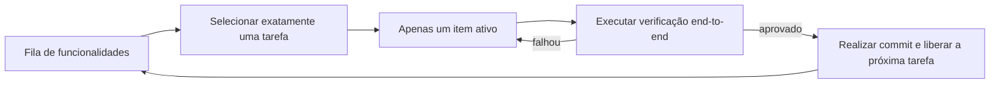
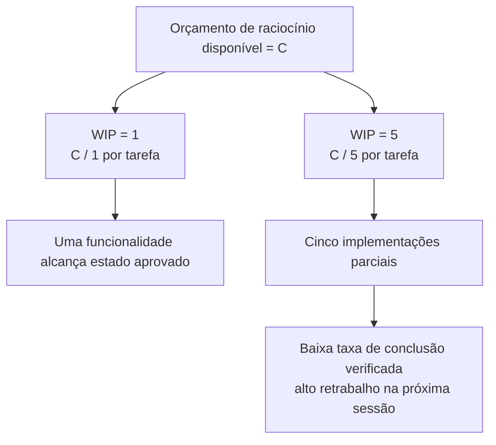

[中文版 →](../../../zh/lectures/lecture-07-why-agents-overreach-and-under-finish/)

> Exemplos de código: [code/](https://github.com/walkinglabs/learn-harness-engineering/blob/main/docs/pt-BR/lectures/lecture-07-why-agents-overreach-and-under-finish/code/)
> Projeto prático: [Projeto 04. Use feedback de execução para corrigir o comportamento do agente](./../../projects/project-04-incremental-indexing/index.md)

# Aula 07. Defina Limites Claros de Tarefa para os Agentes

Você pede ao Claude Code para "adicionar autenticação de usuários a este projeto", e ele começa a modificar o esquema do banco de dados, criar rotas, alterar componentes do frontend e — já que está mexendo nisso — refatorar também o middleware de tratamento de erros. Duas horas depois você verifica o resultado: 12 arquivos modificados, 800 linhas de código novas e nem uma única funcionalidade funcionando de ponta a ponta.

Os agentes nascem com um impulso de "fazer só mais um pouquinho" — eles identificam elementos relacionados e simplesmente resolvem tudo no mesmo fluxo. O problema é que tentar fazer muitas coisas ao mesmo tempo praticamente garante que nenhuma delas será bem concluída.

O artigo de engenharia da Anthropic, *Effective Harnesses for Long-Running Agents*, afirma claramente: quando os prompts são amplos demais, os agentes tendem a "iniciar várias coisas ao mesmo tempo" em vez de "concluir uma coisa antes de começar a próxima". As práticas de engenharia do Codex da OpenAI chegaram à mesma conclusão — tarefas sem controles explícitos de escopo apresentam quedas drásticas nas taxas de conclusão. Isso não é um problema do modelo — é um problema do *harness*. O limite simplesmente não foi definido.

## Atenção É um Recurso Finito

Isso não é uma metáfora — é matemática. Suponha que a capacidade de contexto do agente seja C e que ele ative simultaneamente k tarefas. Cada tarefa receberá, em média, C/k recursos de raciocínio. Quando C/k cai abaixo do limite mínimo necessário para concluir uma única tarefa, nenhuma delas é finalizada.

O comportamento real do Claude Code é bastante revelador. Peça para ele "adicionar registro de usuários" e ele poderá:

1. Criar um modelo User
2. Implementar a rota de registro
3. Perceber que precisa de verificação por e-mail e adicionar um serviço de e-mail
4. Notar que as senhas precisam ser criptografadas e incluir o bcrypt
5. Perceber que o tratamento de erros está inconsistente e refatorar o middleware global de erros
6. Observar que a estrutura dos testes está desorganizada e reorganizar os diretórios

Seis etapas depois, todas estão pela metade. Não existe verificação end-to-end, há um acoplamento complexo entre partes incompletas do código e a próxima sessão que tentar continuar o trabalho ficará completamente perdida.

Os dados experimentais da Anthropic corroboram diretamente esse comportamento: agentes que utilizam uma estratégia de "próximo pequeno passo" (*small next step*), equivalente a WIP=1, apresentam uma taxa de conclusão de tarefas 37% maior do que agentes que recebem prompts amplos. Mais interessante ainda: o número de linhas de código geradas pelos agentes possui uma correlação fracamente negativa com a conclusão efetiva de funcionalidades — quanto mais código é escrito, menos funcionalidades são concluídas. Uma demonstração baseada em dados de que assumir mais trabalho do que se consegue concluir é contraproducente.

## Fluxo de Trabalho WIP=1





## Conceitos Fundamentais

- **Overreach**: O agente ativa mais tarefas em uma única sessão do que o ideal. Isso não é subjetivo — é quantificável: trabalhar em 5 funcionalidades sem que nenhuma passe na verificação end-to-end caracteriza *overreach*.

- **Under-finish**: A proporção de tarefas que passam na verificação end-to-end, em relação ao total de tarefas ativadas, fica abaixo do limite esperado. Código escrito sem que os testes sejam aprovados caracteriza *under-finish*.

- **Limite de WIP (*Work-in-Progress Limit*)**: Conceito originado da metodologia Kanban. A ideia central é limitar quantas tarefas estão em andamento simultaneamente. Para agentes, WIP=1 é o padrão mais seguro — concluir uma tarefa antes de iniciar a próxima.

- **Evidência de Conclusão (*Completion Evidence*)**: A condição verificável que uma tarefa precisa satisfazer para passar do estado "em andamento" para "concluída". Sem isso, os agentes substituem "o código parece correto" por "o comportamento passou nos testes".

- **Superfície de Escopo (*Scope Surface*)**: Uma estrutura em forma de DAG na qual cada nó representa uma unidade de trabalho e as arestas representam dependências. Os estados são limitados a quatro: `not_started`, `active`, `blocked` e `passing`.

- **Pressão de Conclusão (*Completion Pressure*)**: A força restritiva que o *harness* exerce por meio dos limites de WIP e dos requisitos de evidência de conclusão, forçando o agente a finalizar a tarefa atual antes de iniciar uma nova.

## Overreach e Under-finish São Dois Lados da Mesma Moeda

Esses dois problemas não são independentes — eles se reforçam mutuamente. O *overreach* dilui a atenção, a atenção diluída causa *under-finish*, e o código incompleto deixado para trás aumenta a complexidade do sistema, o que incentiva ainda mais *overreach* na tarefa seguinte. Um ciclo vicioso.

Em termos de Kanban, a Lei de Little afirma que L = λ * W. Se o trabalho em andamento (L) for muito alto (muitas tarefas sendo executadas ao mesmo tempo), o tempo de entrega (W) de cada tarefa inevitavelmente aumenta. Para agentes, isso significa que cada funcionalidade leva mais tempo para passar do início à conclusão verificada, e a probabilidade de falha cresce.

Esse é um problema antigo também no mundo humano. Steve McConnell documentou em *Rapid Development* que o crescimento descontrolado do escopo (*scope creep*) é a principal causa de falha em projetos. Os seres humanos, porém, possuem ao menos a intuição de "já fiz o suficiente". Os agentes não possuem essa limitação natural. Gerar uma nova ideia praticamente não tem custo para o modelo — escrever "já que estou aqui, vou corrigir isso também" consome poucos tokens adicionais, mas cada modificação extra dilui ainda mais a atenção do agente.

## Como Fazer da Forma Correta

### 1. Impor WIP=1

Este é o método mais direto e eficaz. No seu *harness*, informe explicitamente ao agente: **apenas uma tarefa pode estar com o status "active" em qualquer momento.** No `CLAUDE.md` do Claude Code ou no `AGENTS.md` do Codex, escreva:

```
## Regras de Trabalho
- Trabalhe em uma funcionalidade por vez
- Só inicie a próxima funcionalidade depois que a atual passar na verificação end-to-end
- Não aproveite a implementação da funcionalidade A para "também refatorar" a funcionalidade B
```

### 2. Defina Evidências Explícitas de Conclusão para Cada Tarefa

Concluído não significa "o código foi escrito" — significa "a verificação do comportamento foi aprovada". Na sua lista de funcionalidades, cada item precisa ter um comando de verificação:

```
F01: Registro de Usuário
  Verificação: curl -X POST /api/register -d '{"email":"test@example.com","password":"123456"}' | jq .status == 201
  Estado: passing
```

### 3. Externalize a Superfície de Escopo

Utilize um arquivo legível por máquina (JSON ou Markdown) para registrar o estado de todas as tarefas. Qualquer nova sessão poderá ler esse arquivo e saber imediatamente: qual tarefa está ativa? Qual comportamento define a conclusão? Quais verificações já foram aprovadas?

### 4. Monitore a Taxa de Conclusão Verificada

O *harness* deve acompanhar continuamente a VCR (*Verified Completion Rate*) = tarefas verificadas / tarefas ativadas. Bloqueie a ativação de novas tarefas quando VCR < 1.0.

## Caso do Mundo Real

Projeto de API REST com 8 funcionalidades, comparando duas estratégias:

**Modo sem restrições**: O agente ativa 5 funcionalidades simultaneamente na sessão 1. Produz cerca de 800 linhas distribuídas em 12 arquivos. Taxa de aprovação dos testes end-to-end: 20% — apenas o registro de usuários funciona. As outras 4 funcionalidades apresentam problemas: esquema de banco de dados criado, mas sem lógica de validação; rotas definidas, mas retornando formatos de resposta incorretos. Ao final da sessão 3, apenas 3 das 8 funcionalidades foram concluídas.

**Modo WIP=1**: O agente trabalha exclusivamente no registro de usuários durante a sessão 1. Produz cerca de 200 linhas distribuídas em 4 arquivos. Testes end-to-end: 100% aprovados. Registra em commit uma implementação limpa e verificada. Ao final da sessão 4, 7 das 8 funcionalidades estão concluídas (a oitava está bloqueada por uma dependência externa).

Resultado: menos código total (800 versus 1200 linhas), porém mais código efetivo. Taxa de conclusão: 87,5% versus 37,5%.

## Principais Conclusões

- **WIP=1 é a configuração padrão mais segura para harnesses de agentes** — conclua uma tarefa antes de iniciar a próxima; não tente paralelizar.
- **A evidência de conclusão deve ser executável** — "o código parece correto" não conta; "o curl retorna 201" conta.
- **A superfície de escopo deve ser externalizada em um arquivo** — não apenas mencionada na conversa, mas registrada em formato legível por máquina dentro do repositório.
- **Overreach e under-finish são fenômenos simbióticos** — resolver um ajuda a resolver o outro.
- **"Fazer menos, mas concluir" sempre supera "fazer mais, mas deixar pela metade"** — a quantidade de linhas de código geradas por agentes e a taxa de conclusão de funcionalidades possuem correlação negativa. Qualidade sempre supera quantidade.

## Leitura Complementar

- [Anthropic: Harnesses eficazes para agentes de longa duração](https://www.anthropic.com/engineering/effective-harnesses-for-long-running-agents) — Blog de engenharia da Anthropic com uma discussão detalhada da estratégia de "próximo pequeno passo" (*small next step*)
- [Harness Engineering - OpenAI](https://openai.com/index/harness-engineering/) — Tratamento completo da OpenAI sobre engenharia de *harness*
- [Kanban: Successful Evolutionary Change - David Anderson](https://www.goodreads.com/book/show/1070822.Kanban) — Referência clássica sobre limites de WIP
- [Rapid Development - Steve McConnell](https://www.goodreads.com/book/show/125171.Rapid_Development) — Dados empíricos sobre crescimento descontrolado de escopo como principal causa de falha em projetos

## Exercícios

1. **Atomização de Tarefas**: Escolha um requisito amplo (por exemplo, "implementar um sistema de gerenciamento de usuários") e divida-o em pelo menos 5 unidades de trabalho atômicas. Para cada unidade, especifique: (a) uma descrição de comportamento único, (b) um comando de verificação executável e (c) suas dependências. Verifique se a decomposição atende à restrição de WIP=1.

2. **Experimento de Comparação**: Execute o mesmo projeto duas vezes — uma sem restrições e outra com WIP=1 imposto. Compare a taxa de conclusão verificada, o total de linhas de código e a proporção de código efetivo.

3. **Auditoria de Evidências de Conclusão**: Revise a saída de uma execução recente do agente, classificando cada alteração de código como "comportamento concluído", "comportamento incompleto" ou "estrutura de suporte (*scaffolding*)". Adicione comandos de verificação ausentes para cada comportamento incompleto.

