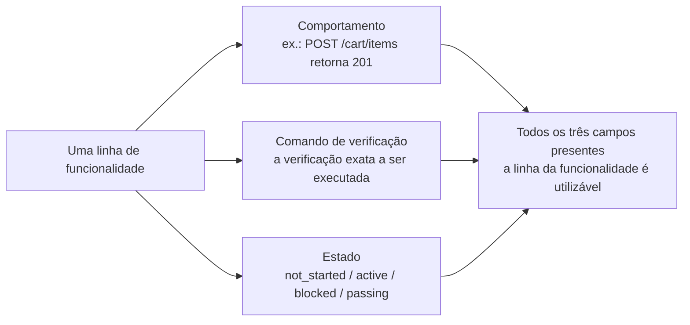
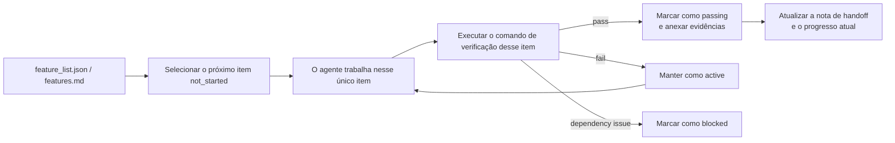

[中文版 →](../../../zh/lectures/lecture-08-why-feature-lists-are-harness-primitives/)

> Exemplos de código: [code/](https://github.com/walkinglabs/learn-harness-engineering/blob/main/docs/pt-BR/lectures/lecture-08-why-feature-lists-are-harness-primitives/code/)
> Projeto prático: [Projeto 04. Feedback em tempo de execução e controle de escopo](./../../projects/project-04-incremental-indexing/index.md)

# Aula 08. Use Listas de Funcionalidades para Restringir o que o Agente Faz

Você pede a um agente para construir um site de e-commerce. Depois que ele termina, ele diz: "concluído". Você olha o código — a autenticação de usuários funciona, mas o botão de checkout no carrinho não faz nada, e o fluxo de pagamento nem sequer está conectado. Onde as coisas deram errado? Você nunca disse ao agente o que significa "concluído", então ele usou o próprio padrão: "escrevi bastante código e parece razoavelmente completo".

Na visão de muitas pessoas, listas de funcionalidades são apenas um lembrete — anote as coisas para não esquecer e depois descarte. Mas no mundo dos harnesses, uma lista de funcionalidades não é um lembrete para humanos. Ela é a estrutura fundamental sobre a qual todo o harness é construído. O escalonador depende dela para selecionar tarefas, o verificador depende dela para julgar a conclusão, e o gerador de relatórios de handoff depende dela para criar resumos. Sem ela, esses componentes não têm um consenso compartilhado em que possam se apoiar.

Tanto a Anthropic quanto a OpenAI enfatizam: **artefatos devem ser externalizados.** O estado das funcionalidades deve existir em um arquivo legível por máquina dentro do repositório, e não em texto de conversa não estruturado.

## Agentes Não Sabem o que Significa "Concluído"

Nem o Claude Code nem o Codex sabem automaticamente o que você quer dizer com "concluído". Você diz "adicione uma funcionalidade de carrinho de compras", e a interpretação do modelo pode ser "escrever um componente Cart e um método addToCart". Mas o que você queria dizer era "o usuário pode navegar pelos produtos, adicionar itens ao carrinho e concluir a compra de ponta a ponta".

Essa lacuna de entendimento persiste sem uma lista de funcionalidades. O agente usa seu próprio padrão implícito — geralmente "o código não tem erros de sintaxe evidentes". O que você precisa é de uma verificação comportamental de ponta a ponta. Sem uma lista, os dois lados nunca concordarão sobre o que significa "concluído".

Veja esta anotação de progresso comum:

```text
Autenticação do usuário concluída, carrinho de compras quase pronto, faltam apenas os pagamentos.
```

Uma nova sessão de agente consegue responder às seguintes perguntas com base nessa anotação? O que significa "quase concluído"? Quais testes o carrinho passou? O que está bloqueando os pagamentos? A resposta para todas elas é: "ninguém sabe".

O resultado: a nova sessão passa 20 minutos tentando inferir o estado do projeto e pode acabar reimplementando funcionalidades já concluídas. Dados de engenharia da Anthropic mostram que bons registros de progresso reduzem o tempo de diagnóstico no início de uma sessão em 60–80%.

## Máquina de Estados das Funcionalidades





## Conceitos Fundamentais

* **Listas de funcionalidades são primitivas do harness**: Não são "ferramentas opcionais de planejamento", mas estruturas de dados fundamentais das quais todos os outros componentes do harness dependem. O escalonador, o verificador e o gerador de relatórios de handoff precisam ler a lista de funcionalidades para funcionar.
* **Estrutura tripla**: Cada item da lista de funcionalidades contém três elementos: `(descrição do comportamento, comando de verificação, estado atual)`. O comportamento informa ao agente o que fazer, a verificação define o que conta como concluído e o estado informa a situação atual. A ausência de qualquer um desses elementos torna o item incompleto.
* **Modelo de máquina de estados**: Cada item de funcionalidade possui quatro estados — `not_started`, `active`, `blocked`, `passing`. As transições de estado são controladas pelo harness, e não alteradas livremente pelo agente.
* **Controle por estado de aprovação (pass-state gating)**: A única forma de uma funcionalidade passar de `active` para `passing` é por meio da execução bem-sucedida do comando de verificação. Essa transição é irreversível — uma vez em `passing`, não pode voltar atrás.
* **Fonte única da verdade (single source of truth)**: Todas as informações sobre "o que precisa ser feito" devem derivar de uma única lista de funcionalidades. Não deve haver contradições entre a lista de funcionalidades e o histórico da conversa.
* **Back-pressure**: O número de funcionalidades que ainda não atingiram o estado `passing` representa a pressão que o harness exerce sobre o agente. Pressão zero = projeto concluído.

## Por que Listas de Funcionalidades Devem Ser "Primitivas"

Documentos são feitos para humanos lerem; primitivas são feitas para sistemas executarem. Documentos podem ser ignorados; primitivas não podem ser contornadas.

Pense nisso como restrições (constraints) de gatilhos de banco de dados versus validações na camada da aplicação: as primeiras são aplicadas pelo mecanismo do banco de dados — nenhum SQL consegue ignorá-las. As segundas dependem da correção do código da aplicação e podem ser contornadas acidentalmente. Listas de funcionalidades como primitivas do harness desempenham o mesmo papel das restrições no nível do banco de dados — o agente não pode ignorá-las.

Especificamente, a lista de funcionalidades atende a quatro componentes do harness:

1. **Scheduler (Escalonador)**: Lê os estados e seleciona a próxima funcionalidade em `not_started`.
2. **Verifier (Verificador)**: Executa os comandos de verificação e decide se permite ou não as transições de estado.
3. **Handoff Reporter (Gerador de Relatórios de Handoff)**: Gera automaticamente resumos de handoff da sessão a partir da lista de funcionalidades.
4. **Progress Tracker (Rastreador de Progresso)**: Consolida a distribuição dos estados e fornece métricas de saúde do projeto.

## Como Fazer

### 1. Defina um Formato Mínimo para a Lista de Funcionalidades

Você não precisa de um sistema complexo — um arquivo Markdown estruturado ou JSON já funciona. O importante é que cada entrada contenha a estrutura tripla:

```json
{
  "id": "F03",
  "behavior": "POST /cart/items with {product_id, quantity} returns 201",
  "verification": "curl -X POST http://localhost:3000/api/cart/items -H 'Content-Type: application/json' -d '{\"product_id\":1,\"quantity\":2}' | jq .status == 201",
  "state": "passing",
  "evidence": "commit abc123, test output log"
}
```

### 2. Permita que o Harness Controle as Transições de Estado

O agente não pode alterar diretamente o estado de uma funcionalidade para `passing`. Ele só pode enviar uma solicitação de verificação. O harness executa o comando de verificação e decide se permite ou não a transição. Isso é chamado de **pass-state gating**.

### 3. Escreva as Regras no CLAUDE.md

```text
## Regras da Lista de Funcionalidades
- Arquivo da lista de funcionalidades: /docs/features.md
- Apenas uma funcionalidade ativa por vez
- O comando de verificação deve ser aprovado antes de marcar como passing
- Não altere os estados da lista de funcionalidades manualmente — o script de verificação os atualiza automaticamente
```

### 4. Calibre a Granularidade

Cada item de funcionalidade deve ter um escopo que possa ser **concluído em uma única sessão**. Se for amplo demais, não será finalizado; se for detalhado demais, o custo de gerenciamento aumenta. "O usuário pode adicionar itens ao carrinho" é uma boa granularidade. "Implementar o carrinho de compras" é amplo demais. "Criar o campo `name` no modelo Cart" é detalhado demais.

## Caso Real

Uma plataforma de e-commerce com 10 funcionalidades. Duas abordagens de acompanhamento foram comparadas:

**Modo memorando**: O agente utiliza anotações não estruturadas para acompanhar o progresso. Após 3 sessões, as anotações se tornam algo como: "autenticação de usuários e lista de produtos concluídas, carrinho de compras quase pronto mas com bugs, pagamentos não iniciados". Uma nova sessão precisa de 20 minutos para inferir o estado do projeto e, no fim, reimplementa funcionalidades já concluídas.

**Modo estruturado**: Cada funcionalidade possui um estado claro e um comando de verificação. Uma nova sessão lê a lista de funcionalidades e, em 3 minutos, sabe que: F01–F05 estão em `passing`, F06 está em `active` (em andamento) e F07–F10 estão em `not_started`. Ela continua diretamente a partir da F06, sem retrabalho.

Resultado quantificado: projetos que utilizam listas de funcionalidades estruturadas apresentam uma taxa de conclusão de funcionalidades 45% maior do que aqueles que utilizam acompanhamento livre, com zero implementações duplicadas.

## Principais Aprendizados

* **Listas de funcionalidades são a estrutura fundamental do harness**, não memorandos para humanos. O scheduler, o verifier e o handoff reporter dependem delas.
* **Cada item de funcionalidade deve conter a estrutura tripla**: descrição do comportamento + comando de verificação + estado atual. A ausência de qualquer elemento torna o item incompleto.
* **As transições de estado são controladas pelo harness** — o agente não pode alterar estados por conta própria. Uma verificação aprovada é o único caminho para promoção de estado.
* **A lista de funcionalidades é a fonte única da verdade do projeto** — todas as informações sobre "o que fazer" derivam dela.
* **Calibre a granularidade para algo que possa ser concluído em uma única sessão.** Se for amplo demais, não será finalizado; se for detalhado demais, torna-se difícil de gerenciar.

## Leitura Complementar

* [Construindo Agentes Eficazes - Anthropic](https://www.anthropic.com/research/building-effective-agents) — Identifica explicitamente a lista de funcionalidades como a "estrutura de dados central" para controlar o escopo do agente.
* [Harness Engineering - OpenAI](https://openai.com/index/harness-engineering/) — Enfatiza o princípio da "externalização de artefatos".
* [Design by Contract - Bertrand Meyer](https://www.goodreads.com/book/show/130439.Object_Oriented_Software_Construction) — Princípios de Design by Contract, a base teórica das listas de funcionalidades.
* [Como o Google testa softwares](https://www.goodreads.com/book/show/13563030-how-google-tests-software) — Pirâmide de testes e práticas de engenharia de especificação comportamental.

## Exercícios

1. **Projeto de Lista de Funcionalidades**: Defina um esquema JSON mínimo para uma lista de funcionalidades. Inclua: id, descrição do comportamento, comando de verificação, estado atual e referência de evidência. Use-o para descrever um projeto real com 5 funcionalidades.

2. **Comparação de Rigor na Verificação**: Escolha 3 funcionalidades e projete tanto uma verificação "flexível" (por exemplo, "o código não possui erros de sintaxe") quanto uma verificação "rigorosa" (por exemplo, "o teste end-to-end passa com sucesso"). Compare as taxas de falso positivo em cada abordagem.

3. **Auditoria do Princípio da Fonte Única da Verdade**: Revise um projeto existente com agentes e verifique informações de escopo que contradizem a lista de funcionalidades (requisitos implícitos em conversas, comentários TODO no código etc.). Elabore um plano para unificar todas as informações na lista de funcionalidades.
