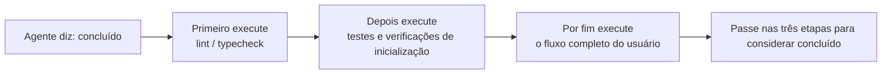
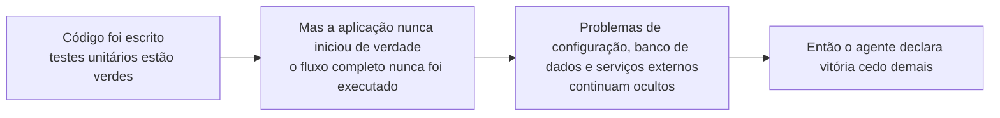

[中文版 →](../../../zh/lectures/lecture-09-why-agents-declare-victory-too-early/)

> Exemplos de código para esta aula: [code/](https://github.com/walkinglabs/learn-harness-engineering/blob/main/docs/pt-BR/lectures/lecture-09-why-agents-declare-victory-too-early/code/)
> Prática guiada: [Projeto 05. Permita que o agente verifique o próprio trabalho](./../../projects/project-05-grounded-qa-verification/index.md)

# Aula 09. Como Impedir que Agentes Declarem Vitória Cedo Demais

Você pede a um agente para implementar uma funcionalidade de "redefinição de senha". Ele modifica o esquema do banco de dados, cria o endpoint da API, adiciona o template de e-mail, executa os testes unitários (todos passam) e então afirma com confiança: "está pronto". Mas quando você realmente tenta usar a funcionalidade, descobre que o link de redefinição de senha não pode ser enviado porque a configuração do serviço de e-mail está ausente; a migração do banco de dados falha no meio da execução, deixando o esquema em um estado inconsistente; e o fluxo completo de ponta a ponta nunca foi executado sequer uma vez.

Isso não é um incidente isolado. O clássico artigo da ICML de 2017, de Guo et al., demonstrou que **redes neurais modernas são sistematicamente excessivamente confiantes** — a confiança relatada pelos modelos é significativamente maior do que sua precisão real. Agentes de programação com IA não são diferentes. Eles "sentem" que terminaram, mas, na prática, estão longe disso. Seu harness deve substituir os "sentimentos" do agente por verificações externalizadas e baseadas em execução.

## A Ladeira Escorregadia

Declarações prematuras de conclusão quase sempre seguem o mesmo roteiro: o código parece correto — a sintaxe está certa, a lógica parece razoável e a análise estática não aponta erros evidentes. Porém, o harness não exige uma verificação completa por execução, então o agente deixa de executar o sistema de fato ou executa apenas testes parciais. Ele roda os testes unitários, mas ignora os testes de integração; executa testes, mas não verifica cobertura. No final, "o código parece bom" é tratado como evidência de que "a funcionalidade está concluída".

Informação é perdida em cada etapa. Da especificação da tarefa à implementação do código e ao comportamento em tempo de execução, cada transformação pode introduzir vieses, e cada verificação ignorada aumenta a assimetria de informação.

## Verificação de Conclusão em Três Camadas





## Conceitos Fundamentais

* **Declaração Prematura de Conclusão (Premature Completion Declaration)**: O agente afirma que a tarefa está concluída, mas ainda existem requisitos de correção não atendidos. O problema central é que o agente julga com base em confiança local, no nível do código, enquanto a correção do sistema exige verificação global.
* **Viés de Calibração da Confiança (Confidence Calibration Bias)**: Uma lacuna sistemática entre a confiança de conclusão reportada pelo agente e a qualidade real da conclusão. Em tarefas complexas envolvendo múltiplos arquivos, esse viés tende a ser significativamente positivo — o agente é consistentemente mais confiante do que seu desempenho real justifica.
* **Critérios de Conclusão (Termination Criteria)**: Um conjunto claro e executável de condições de julgamento definidas no harness. O agente deve satisfazer todas as condições antes de declarar a tarefa concluída. "Concluído" deixa de ser um julgamento subjetivo e passa a ser uma determinação objetiva.
* **Dupla Barreira de Verificação e Validação (Verification-Validation Dual Gate)**: A primeira camada (verificação) confirma se o código implementa corretamente o comportamento especificado; a segunda camada (validação) verifica se o comportamento do sistema atende aos requisitos de ponta a ponta. Ambas devem ser aprovadas para que a tarefa seja considerada concluída.
* **Sinais de Feedback em Tempo de Execução (Runtime Feedback Signals)**: Logs, estados de processos e verificações de integridade (health checks) obtidos durante a execução do programa — eles formam a base objetiva para que o harness julgue a qualidade da conclusão.
* **Restrição de Prioridade da Conclusão (Completion Priority Constraint)**: Primeiro verifica-se a correção funcional, depois o desempenho e, por fim, o estilo. Nenhuma refatoração deve ocorrer antes que a funcionalidade principal tenha sido verificada.

## Passar nos Testes Unitários ≠ Tarefa Concluída

Esta é a armadilha mais comum — e também a mais perigosa. O agente escreve o código, executa os testes unitários, vê tudo verde e diz: "concluído". Mas a própria filosofia dos testes unitários — isolar a unidade testada e simular (mockar) dependências — é justamente o que os torna incapazes de detectar problemas entre componentes.

**Incompatibilidade de Interface (Interface Mismatch)**: O renderer passa um caminho de arquivo relativo para o script de preload, mas o script de preload espera um caminho absoluto. Os testes unitários de ambos utilizam mocks e passam com sucesso. O problema só aparece durante testes end-to-end.

**Erros de Propagação de Estado (State Propagation Errors)**: Uma migração de banco de dados altera o esquema de uma tabela, mas a camada de cache do ORM ainda mantém entradas referentes ao esquema antigo. Como os testes unitários sempre executam em um ambiente simulado e limpo, esse tipo de inconsistência entre camadas nunca aparece.

**Dependência de Ambiente (Environment Dependency)**: O código funciona corretamente no ambiente de testes (onde tudo é mockado), mas falha no ambiente real devido a diferenças de configuração, latência de rede ou indisponibilidade de serviços.

### "Já que Estamos Aqui, Vamos Refatorar" é Veneno para o Julgamento de Conclusão

O Claude Code apresenta um padrão comportamental comum: começa a refatorar código, otimizar desempenho e melhorar estilo antes que a funcionalidade principal tenha passado pela verificação. O famoso ditado de Knuth de que "otimização prematura é a raiz de todos os males" ganha um novo significado no contexto de agentes — a refatoração desloca a fronteira entre código verificado e não verificado, podendo quebrar caminhos de execução que anteriormente estavam corretos, ainda que implicitamente.

### Viés Sistemático na Autoavaliação

A Anthropic identificou um padrão de falha ainda mais profundo em suas pesquisas de 2026: **quando um agente é solicitado a avaliar o próprio trabalho, ele tende sistematicamente a fornecer avaliações excessivamente positivas — mesmo quando um observador humano consideraria a qualidade claramente abaixo do esperado.**

Esse problema é especialmente grave em tarefas subjetivas (como estética de design). Determinar se um "layout está bem acabado" envolve julgamento, e o agente tende consistentemente a avaliar de forma positiva. Mesmo em tarefas com resultados verificáveis, a qualidade do julgamento do agente prejudica seu desempenho.

A solução não é tornar o agente "mais objetivo". O mesmo modelo gera e avalia o trabalho, portanto ele é inerentemente inclinado a ser generoso consigo mesmo. **A solução é separar o "executor" do "avaliador".**

Um agente de avaliação independente, especificamente ajustado para ser criterioso e encontrar problemas, é muito mais eficaz do que fazer o agente gerador avaliar a si mesmo. Dados experimentais da Anthropic:

| Arquitetura                                     | Tempo de Execução | Custo   | Funcionalidades Principais Funcionando?                    |
| ----------------------------------------------- | ----------------- | ------- | ---------------------------------------------------------- |
| Agente único (execução simples)                 | 20 min            | US$ 9   | Não (entidades do jogo não respondem à entrada do usuário) |
| Três agentes (planejador + gerador + avaliador) | 6 horas           | US$ 200 | Sim (o jogo é totalmente jogável)                          |

Trata-se exatamente do mesmo modelo (Opus 4.5) com exatamente o mesmo prompt ("construa um editor de jogos retrô 2D"). A única diferença é o harness: em vez de uma **execução simples**, utiliza-se um fluxo em que o **planejador expande os requisitos → o gerador implementa funcionalidade por funcionalidade → o avaliador realiza testes reais de clique usando Playwright**.

> Fonte: [Anthropic: Design de Harness para desenvolvimento de aplicações de longa duração](https://www.anthropic.com/engineering/harness-design-long-running-apps)

## Como Evitar Declarações Prematuras de Conclusão

### 1. Externalize o Julgamento de Conclusão

O julgamento de conclusão não deve ser feito pelo próprio agente. O harness executa a validação de conclusão de forma independente, usando sinais de tempo de execução como entrada em vez da confiança do agente. Em `CLAUDE.md`, você pode explicitar isso:

```
## Definição de Concluído
- Funcionalidade concluída = verificação end-to-end aprovada, não apenas "o código foi escrito"
- Níveis de verificação obrigatórios:
  1. Testes unitários aprovados
  2. Testes de integração aprovados
  3. Verificação do fluxo end-to-end aprovada
- Não avance para o nível 2 se o nível 1 falhar
- Não avance para o nível 3 se o nível 2 falhar
```

### 2. Construa uma Validação de Conclusão em Três Camadas

* **Camada 1: Sintaxe e Análise Estática**. Menor custo, menor quantidade de informação, mas obrigatória. Este é o mínimo necessário — você precisa escrever as palavras corretamente antes de continuar a leitura.
* **Camada 2: Verificação do Comportamento em Tempo de Execução**. Execução de testes, verificações de inicialização da aplicação e validação de caminhos críticos. Esta é a principal evidência de conclusão — não apenas escrito, mas executável.
* **Camada 3: Confirmação em Nível de Sistema**. Testes end-to-end, validação de integração e simulação de cenários de usuário. É a última linha de defesa contra declarações prematuras — não apenas executável, mas correto.

### 3. Forneça Feedback de Erro Acionável ao Agente

A OpenAI introduziu um padrão particularmente eficaz em sua prática com o Codex: **mensagens de erro escritas para agentes devem incluir instruções de correção**. Não diga apenas ao agente "está errado" — indique exatamente o que está errado e como corrigir. Em vez de usar `"Test failed"`, use `"Test failed: POST /api/reset-password retornou 500. Verifique se a configuração do serviço de e-mail existe nas variáveis de ambiente. O arquivo de template deve estar em templates/reset-email.html."` Esse tipo de feedback específico e acionável permite que o agente se autocorrija sem intervenção humana.

### 4. Capture Sinais de Tempo de Execução

Sinais eficazes de tempo de execução incluem:

* A aplicação iniciou com sucesso e atingiu um estado pronto?
* Os caminhos críticos da funcionalidade foram executados com sucesso em tempo de execução?
* As gravações no banco de dados, operações de arquivo e outros efeitos colaterais ocorreram corretamente?
* Os recursos temporários foram limpos adequadamente?

## Caso Real

**Tarefa**: Implementar a funcionalidade de redefinição de senha de usuários. Envolve operações de banco de dados, envio de e-mails e modificações em endpoints da API.

**Caminho da entrega prematura**: O agente modifica o esquema do banco de dados, cria o endpoint da API, adiciona o template de e-mail, executa os testes unitários (todos passam) e declara a tarefa concluída. Parece que muito trabalho foi feito, mas todas as etapas críticas foram ignoradas.

**Omissões reais**:

1. O fluxo end-to-end não foi testado — o envio e a validação do link de redefinição nunca foram confirmados.
2. A migração do banco de dados falhou após uma execução parcial, deixando o esquema inconsistente.
3. A configuração do serviço de e-mail estava ausente no ambiente de destino.

**Intervenção do harness**: A validação de conclusão é aplicada obrigatoriamente:

1. Iniciar a aplicação completa para verificar se o endpoint de redefinição está acessível.
2. Executar o fluxo completo de redefinição.
3. Verificar a consistência do estado do banco de dados.

Todos os defeitos foram descobertos durante a sessão, economizando de 5 a 10 vezes o custo de correções posteriores.

## Principais Aprendizados

* **Agentes são sistematicamente excessivamente confiantes** — o viés de calibração da confiança é uma realidade objetiva. O fato de o código ter sido escrito não significa que foi escrito corretamente.
* **O julgamento de conclusão deve ser externalizado** — o harness realiza a verificação de forma independente. Não confie nos "sentimentos" do agente.
* **As três camadas de validação são essenciais**: sintaxe aprovada, comportamento aprovado e sistema aprovado — camada por camada, sem atalhos.
* **Mensagens de erro devem incluir etapas específicas de correção**, permitindo que o agente se autocorrija em vez de apenas receber a informação de que "está errado".
* **Nenhuma refatoração antes da verificação da funcionalidade principal** — a restrição de prioridade da conclusão é a chave para evitar otimizações prematuras.

## Leitura Complementar

* [Sobre a Calibração de Redes Neurais Modernas - Guo et al.](https://arxiv.org/abs/1706.04599) — Demonstra que redes neurais profundas modernas são sistematicamente excessivamente confiantes.
* [Construindo Agentes Eficazes - Anthropic](https://www.anthropic.com/research/building-effective-agents) — O papel crítico das evidências de tempo de execução no julgamento de conclusão.
* [Harness Engineering - OpenAI](https://openai.com/index/harness-engineering/) — Declarações prematuras de conclusão são um dos principais modos de falha dos agentes.
* [A Arte de Testar Software - Myers](https://www.goodreads.com/book/show/137543.The_Art_of_Software_Testing) — Referência clássica sobre hierarquias de métodos de teste e sua eficácia.

## Exercícios

1. **Projeto de Função de Validação de Conclusão**: Projete uma validação completa de conclusão para uma tarefa que envolva migração de banco de dados e modificações em APIs. Liste os sinais de tempo de execução necessários e os critérios de aprovação/reprovação para cada um. Execute-a em uma tarefa real e registre quais problemas ocultos ela descobre.

2. **Medição do Viés de Calibração**: Selecione 10 tarefas de programação de diferentes tipos. Registre a confiança de conclusão reportada pelo agente e compare-a com a qualidade real da conclusão. Calcule o viés e analise sua relação com a complexidade da tarefa.

3. **Experimento de Defesa em Múltiplas Camadas**: Execute três configurações sobre o mesmo conjunto de tarefas: (a) apenas análise estática, (b) análise estática + testes unitários, (c) validação completa em três camadas. Compare a proporção de declarações prematuras de conclusão e o número de defeitos não detectados.

