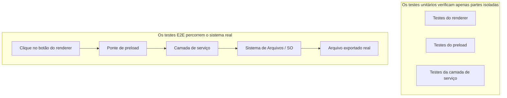
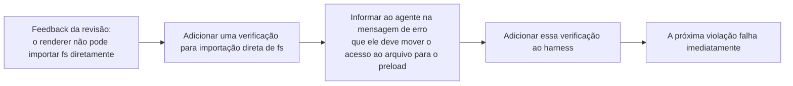

[中文版 →](../../../zh/lectures/lecture-10-why-end-to-end-testing-changes-results/)

> Exemplos de código para esta aula: [code/](https://github.com/walkinglabs/learn-harness-engineering/blob/main/docs/pt-BR/lectures/lecture-10-why-end-to-end-testing-changes-results/code/)
> Prática hands-on: [Projeto 05. Deixe o agente verificar o próprio trabalho](./../../projects/project-05-grounded-qa-verification/index.md)

# Aula 10. Apenas uma Execução Completa do Pipeline Conta como Verificação Real

Você pede ao agente para adicionar uma funcionalidade de exportação de arquivos a uma aplicação Electron. Ele escreve o componente do renderer, o script de preload e a lógica da camada de serviço. Os testes unitários de todos os componentes passam. O agente diz "concluído". Você realmente clica no botão de exportação — o formato do caminho do arquivo está incorreto, a barra de progresso não responde e a exportação de arquivos grandes causa vazamento de memória. Cinco defeitos nas fronteiras entre componentes, e os testes unitários não detectaram nenhum deles.

Cada parte parece "correta" por si só, mas os problemas surgem no momento em que tudo é conectado. A Pirâmide de Testes do Google nos diz que uma ampla base de testes unitários é essencial, mas parar por aí significa que você deixará de identificar sistematicamente problemas de interação entre componentes. Para agentes de programação com IA, esse problema é ainda pior, porque eles tendem a executar apenas os testes mais rápidos e então declarar a tarefa concluída. **Somente testes end-to-end podem comprovar a ausência de defeitos em nível de sistema.**

## Os Pontos Cegos dos Testes Unitários

A filosofia de design dos testes unitários é o isolamento: simular dependências (mocks) e focar na unidade em teste. Essa filosofia torna os testes unitários rápidos e precisos, mas também cria pontos cegos sistemáticos. Cada módulo funciona perfeitamente de forma isolada, porém as seguintes categorias de problemas só aparecem quando tudo realmente é executado em conjunto:

**Incompatibilidade de Interface**: O renderer passa ao script de preload um caminho de arquivo relativo, mas o script de preload espera um caminho absoluto. Os respectivos testes unitários de ambos utilizam mocks e passam com sucesso. O problema só é descoberto quando o fluxo end-to-end é exercitado.

**Erros de Propagação de Estado**: Uma migração de banco de dados altera o esquema de uma tabela, mas a camada de cache do ORM ainda mantém entradas com o esquema antigo. Os testes unitários iniciam um ambiente simulado limpo a cada execução, portanto nunca expõem esse tipo de inconsistência de estado entre camadas.

**Problemas no Ciclo de Vida de Recursos**: A aquisição e liberação de file handles, conexões de banco de dados e sockets de rede envolvem múltiplos componentes. Os testes unitários criam e encerram recursos independentes para cada caso de teste, portanto nunca revelam contenção de recursos ou vazamentos.

**Dependência de Ambiente**: O código se comporta corretamente no ambiente de testes (onde tudo é simulado), mas falha no ambiente real devido a diferenças de configuração, latência de rede ou indisponibilidade de serviços.

## Testes End-to-End Não Apenas Mudam os Resultados — Eles Mudam o Comportamento

Este é um ponto que muitas pessoas ignoram: quando um agente sabe que seu trabalho será validado por testes end-to-end, seu comportamento de programação muda.

1. **Considerar interações entre componentes**: Enquanto escreve o código, ele começa a se perguntar "como esta interface se conecta ao componente anterior?" em vez de focar apenas em uma função isolada.
2. **Respeitar limites arquiteturais**: Em sistemas com restrições arquiteturais, testes end-to-end forçam o agente a seguir as regras de fronteira entre componentes.
3. **Tratar caminhos de erro**: Testes end-to-end normalmente incluem cenários de falha, o que leva o agente a pensar sobre tratamento de exceções.

## Pirâmide de Testes e Promoção de Feedback de Revisão de Código





A OpenAI enfatiza em suas práticas de engenharia para Codex: **mensagens de erro escritas para agentes devem incluir instruções de correção.** Em vez de escrever `"Acesso direto ao sistema de arquivos no renderer"`, escreva `"Acesso direto ao sistema de arquivos no renderer. Todas as operações de arquivo devem passar pela ponte de preload. Mova esta chamada para preload/file-ops.ts e invoque-a via window.api."` Isso transforma regras arquiteturais em um ciclo de autocorreção. As mensagens de erro não apenas informam "o que deu errado" — elas informam "como corrigir", permitindo que o agente se corrija de forma autônoma.

## Conceitos Fundamentais

- **Defeitos nas Fronteiras entre Componentes (Component Boundary Defects)**: Os componentes A e B passam em seus testes unitários individualmente, mas a interação entre eles produz um comportamento incorreto. Esta é a categoria de problema que os testes end-to-end são especialmente eficazes em detectar.
- **Gradiente de Adequação dos Testes (Testing Adequacy Gradient)**: Defeitos detectáveis por testes unitários <= defeitos detectáveis por testes de integração <= defeitos detectáveis por testes end-to-end. A capacidade de detecção aumenta a cada camada.
- **Regras de Aplicação de Fronteiras Arquiteturais (Architectural Boundary Enforcement Rules)**: Transformar regras descritas em documentos de arquitetura (como "o processo renderer não deve acessar o sistema de arquivos diretamente") em verificações automatizadas e executáveis — saindo do "escrito no papel" para o "executado no CI".
- **Promoção de Feedback de Revisão (Review Feedback Promotion)**: Converter comentários recorrentes de revisão de código em testes automatizados. Sempre que uma nova categoria de problema recorrente for identificada, adiciona-se uma regra, tornando o harness automaticamente mais robusto.
- **Mensagens de Erro Orientadas para Agentes (Agent-Oriented Error Messages)**: As mensagens de falha não devem apenas indicar "o que deu errado", mas também informar ao agente exatamente como corrigir o problema, transformando falhas de teste em ciclos de feedback autocorretivos.

## Como Fazer

### 0. Defina as Fronteiras Arquiteturais Antes de Escrever Testes E2E

O pré-requisito para testes end-to-end é que o sistema possua fronteiras bem definidas. Se a arquitetura for uma grande confusão de dependências, os testes end-to-end apenas comprovarão que "a confusão inteira funciona", sem indicar onde a intenção arquitetural foi violada.

Experiência da OpenAI: **em bases de código geradas por agentes, as restrições arquiteturais devem ser estabelecidas como pré-requisitos desde o primeiro dia — não algo para ser considerado apenas quando a equipe crescer.** O motivo é simples: agentes copiam padrões existentes no repositório, mesmo quando esses padrões são inconsistentes ou inadequados. Sem restrições arquiteturais, os agentes introduzem mais desvios a cada sessão.

A OpenAI adotou uma "Arquitetura de Domínio em Camadas" (*Layered Domain Architecture*), na qual cada domínio de negócio é dividido em camadas fixas: Types -> Config -> Repo -> Service -> Runtime -> UI. As dependências fluem estritamente para frente, e preocupações entre domínios entram apenas por meio de interfaces Providers explícitas. Qualquer outra dependência é proibida e aplicada mecanicamente por regras de lint personalizadas.

Princípio fundamental: **Aplique invariantes; não microgerencie a implementação.** Por exemplo, exija que "os dados sejam processados na fronteira", mas não determine qual biblioteca deve ser utilizada. As mensagens de erro devem incluir instruções de correção — não apenas informar que houve uma violação, mas explicar concretamente ao agente como corrigi-la.

> Fonte: [OpenAI: Engenharia de Harness: aproveitando o Codex em um mundo centrado em agentes.](https://openai.com/index/harness-engineering/)

### 1. O Harness Deve Incluir uma Camada End-to-End

Deixe explícito no seu fluxo de validação: para tarefas que envolvem alterações em múltiplos componentes, a aprovação nos testes end-to-end é um pré-requisito para considerar a tarefa concluída:

```
## Hierarquia de Validação
- Nível 1: Testes unitários (Devem passar)
- Nível 2: Testes de integração (Devem passar)
- Nível 3: Testes end-to-end (Devem passar quando houver alterações entre componentes)
- Pular qualquer nível obrigatório = Não Concluído
```

### 2. Transforme Regras Arquiteturais em Verificações Executáveis

Toda restrição arquitetural deve possuir um teste ou regra de lint correspondente:

```bash
# Verifica se o processo renderer está chamando APIs do Node.js diretamente
grep -r "require('fs')" src/renderer/ && exit 1 || echo "OK: nenhum acesso direto ao fs no renderer"
```

### 3. Projete Mensagens de Erro Orientadas para Agentes

Mensagens de falha devem conter três elementos: o que deu errado, por que aconteceu e como corrigir:

```
ERRO: Importação direta de 'fs' encontrada em src/renderer/App.tsx:12
MOTIVO: O processo renderer não possui acesso às APIs do Node.js por razões de segurança
CORREÇÃO: Mova as operações de arquivo para src/preload/file-ops.ts e faça a chamada via window.api.readFile()
```

### 4. Estabeleça um Processo de Promoção de Feedback de Revisão

Sempre que você descobrir uma nova categoria de erro cometido por agentes durante a revisão de código, transforme-a em uma verificação automatizada. Um mês depois, seu harness estará muito mais robusto do que estava no início do mês.

## Caso Real

**Tarefa**: Implementar uma funcionalidade de exportação de arquivos em uma aplicação Electron. Envolve a interface do processo renderer, um proxy de sistema de arquivos no script de preload e a camada de serviço responsável pela transformação dos dados.

**Fase de testes unitários**: Testes do componente renderer (aprovados, operações de arquivo simuladas), testes do script de preload (aprovados, sistema de arquivos simulado), testes da camada de serviço (aprovados, fonte de dados simulada). O agente declara a tarefa concluída.

**Defeitos revelados pelos testes end-to-end**:

| Defeito | Descrição | Teste Unitário | E2E |
|----------|-----------|----------------|-----|
| Incompatibilidade de Interface | Formato inconsistente do caminho do arquivo | Não detectado | Detectado |
| Propagação de Estado | O progresso da exportação não foi enviado de volta para a UI via IPC | Não detectado | Detectado |
| Vazamento de Recursos | Handles de exportação de arquivos grandes não foram liberados | Não detectado | Detectado |
| Problema de Permissão | Permissões diferentes no ambiente empacotado | Não detectado | Detectado |
| Propagação de Erros | Exceções da camada de serviço não chegaram à camada de UI | Não detectado | Detectado |

Todos os 5 defeitos foram detectados pelos testes end-to-end; os testes unitários não detectaram nenhum. O custo foi um aumento no tempo de execução dos testes de 2 segundos para 15 segundos — perfeitamente aceitável em um fluxo de trabalho com agentes.

## Principais Conclusões

- **Testes unitários possuem um ponto cego sistemático para defeitos nas fronteiras entre componentes**: seu design baseado em isolamento é exatamente o que os impede de detectar problemas de interação.
- **Testes end-to-end não apenas detectam defeitos, mas também mudam a forma como os agentes escrevem código**: eles direcionam o foco para integração e fronteiras entre componentes.
- **Regras arquiteturais precisam ser executáveis**: não devem ficar escritas em um documento esperando que alguém as leia, mas serem verificadas automaticamente a cada commit.
- **Mensagens de erro devem ser projetadas para agentes**: inclua passos concretos de "como corrigir" para criar um ciclo de feedback autocorretivo.
- **A promoção de feedback de revisão fortalece o harness automaticamente**: cada categoria de defeito capturada se torna uma linha permanente de defesa.

## Leitura Complementar

- [Como o Google testa softwares - Whittaker et al.](https://www.goodreads.com/book/show/13563030-how-google-tests-software) — A fonte clássica do modelo da Pirâmide de Testes
- [Harness Engineering - OpenAI](https://openai.com/index/harness-engineering/) — Práticas de engenharia para aplicação automatizada de restrições arquiteturais
- [Chaos Engineering - Netflix (Basiri et al.)](https://ieeexplore.ieee.org/document/7466237) — Injeção proativa de falhas para verificar a resiliência de sistemas
- [QuickCheck - Claessen & Hughes](https://www.cs.tufts.edu/~nr/cs257/archive/john-hughes/quick.pdf) — Metodologia de testes baseados em propriedades, posicionada entre testes baseados em exemplos e verificação formal

## Exercícios

1. **Detecção de Defeitos Entre Componentes**: Escolha uma tarefa de modificação que envolva pelo menos três componentes. Primeiro execute apenas os testes unitários e registre os resultados; depois execute os testes end-to-end. Analise cada defeito adicional descoberto e classifique qual tipo de problema de interação entre camadas ele representa.

2. **Automação de Regras Arquiteturais**: Escolha uma restrição arquitetural do seu projeto e transforme-a em uma verificação executável (incluindo uma mensagem de erro orientada para agentes). Integre-a ao harness e valide sua eficácia utilizando uma tarefa de referência.

3. **Promoção de Feedback de Revisão**: Encontre um tipo recorrente de comentário no histórico de revisões de código e converta-o em uma verificação automatizada seguindo o processo de cinco etapas. Compare a frequência dessa categoria de problema antes e depois da promoção.
