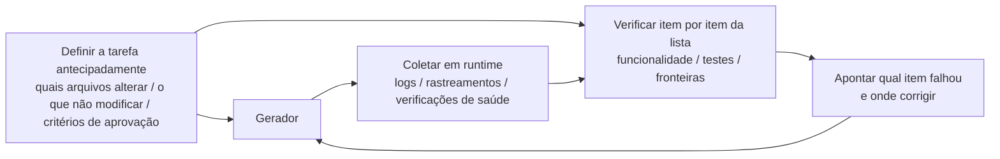

[中文版 →](../../../zh/lectures/lecture-11-why-observability-belongs-inside-the-harness/)

> Exemplos de código: [code/](https://github.com/walkinglabs/learn-harness-engineering/blob/main/docs/pt-BR/lectures/lecture-11-why-observability-belongs-inside-the-harness/code/)
> Projeto prático: [Projeto 06. Construa um Harness Completo para Agentes](./../../projects/project-06-runtime-observability-and-debugging/index.md)

# Aula 11. Tornando o Runtime do Agente Observável

Você pede a um agente para implementar uma funcionalidade. Ele executa a tarefa por 20 minutos, modifica uma pilha de arquivos e então informa: "concluído, mas dois testes estão falhando". Você pergunta o motivo — "não tenho certeza, pode ser um problema de temporização". Você pergunta quais caminhos críticos foram alterados — "deixe-me verificar o código..."

Esse cenário é extremamente comum, e a causa raiz não é a capacidade do agente — é a falta de observabilidade do harness. Quando um agente executa uma tarefa sem visibilidade do estado real do runtime, praticamente toda decisão que ele toma é baseada em suposição.

**Sem observabilidade, agentes tomam decisões sob incerteza, avaliações se tornam julgamentos subjetivos e tentativas de correção viram exploração às cegas.** Tanto a OpenAI quanto a Anthropic tratam confiabilidade como um problema de evidência: o harness precisa expor o comportamento em runtime e os sinais de avaliação de uma forma que realmente oriente a próxima decisão.

## O Custo Real da Falta de Observabilidade

Quando um harness não possui observabilidade, quatro categorias de problemas aparecem de forma sistemática.

**Não é possível distinguir "está correto" de "parece correto".** Uma função parece perfeitamente correta durante a revisão de código — sintaxe adequada, lógica consistente. Porém, em runtime, um erro no tratamento de uma condição de contorno produz resultados incorretos para entradas específicas. Apenas rastreamentos de execução (*runtime traces*) conseguem revelar que o caminho de execução real divergiu do esperado. A revisão de código mostra "o que foi escrito"; o rastreamento de runtime mostra "o que realmente foi executado". Você precisa dos dois.

**A avaliação se torna mística.** Sem rubricas de pontuação e critérios de aceitação, avaliadores (humanos ou agentes) acabam dependendo de pressupostos implícitos. A mesma saída pode receber avaliações completamente diferentes de avaliadores distintos. A avaliação de qualidade deixa de ser reproduzível.

**As tentativas de correção se tornam suposições cegas.** Quando o agente não sabe por que algo falhou, a direção da correção é aleatória. Ele pode insistir repetidamente na direção errada — corrigindo caminhos de código não relacionados enquanto ignora a verdadeira causa raiz. Cada tentativa cega consome tokens e tempo.

**Abismo de informação na troca de sessão.** Quando um trabalho incompleto é transferido para uma nova sessão, a falta de observabilidade faz com que a nova sessão precise diagnosticar o estado do sistema do zero. Observações da Anthropic sobre agentes de longa duração mostram que esse diagnóstico redundante pode consumir entre 30% e 50% do tempo total da sessão.

## Um Cenário Real com Claude Code

Considere um harness utilizando um fluxo de trabalho com três papéis: planejador (*planner*), gerador (*generator*) e avaliador (*evaluator*), executando a tarefa "adicionar modo escuro ao aplicativo".

**Sem observabilidade:** O planejador produz uma descrição vaga. O gerador implementa o modo escuro com base nessa descrição imprecisa, mas o resultado não corresponde às expectativas implícitas do planejador. O avaliador rejeita a implementação com base em seus próprios critérios implícitos, mas não consegue explicar especificamente o problema — apenas afirma que "não parece correto". O gerador tenta corrigir o problema usando justificativas vagas. O ciclo se repete de três a quatro vezes, consumindo cerca de 45 minutos e produzindo apenas um resultado aceitável.

**Com observabilidade completa:** O planejador produz um contrato de sprint listando quais componentes devem ser modificados, os critérios de verificação de cada um e as exclusões (por exemplo, não alterar estilos de impressão). O gerador implementa a funcionalidade seguindo esse contrato, e a observabilidade de runtime registra o processo de carregamento e aplicação de estilos em cada componente. O avaliador utiliza uma rubrica de pontuação para avaliar cada dimensão separadamente, apresentando evidências específicas: "O contraste de cores do botão é insuficiente (padrão WCAG AA 4,5:1, valor medido 2,1:1)." Uma única iteração produz um resultado de alta qualidade em aproximadamente 15 minutos.

Uma diferença de eficiência de 3x. A única variável alterada é a observabilidade.

## Observabilidade em Camadas

Observabilidade não significa apenas "adicionar mais logs". Ela opera em duas camadas, e ambas são essenciais.



**Observabilidade de Runtime:** Sinais em nível de sistema — logs, rastreamentos (*traces*), eventos de processo e verificações de saúde (*health checks*). Responde à pergunta: "o que o sistema fez?"

**Observabilidade de Processo:** Visibilidade sobre os artefatos de decisão do harness — planos, rubricas de pontuação e critérios de aceitação. Responde à pergunta: "por que essa alteração deve ser aceita?"

## Conceitos Fundamentais

- **Observabilidade de Runtime (Runtime Observability)**: Sinais em nível de sistema, incluindo logs, rastreamentos (*traces*), eventos de processo e verificações de saúde (*health checks*). Responde à pergunta: "o que o sistema fez?"
- **Observabilidade de Processo (Process Observability)**: Visibilidade sobre os artefatos de decisão do harness, incluindo planos, rubricas de pontuação e critérios de aceitação. Responde à pergunta: "por que esta alteração deve ser aceita?"
- **Rastro de Tarefa (Task Trace)**: Um registro completo do caminho de decisão desde o início até a conclusão da tarefa, análogo ao rastreamento de requisições em sistemas distribuídos. Cada passo executado pelo agente, juntamente com seu contexto, é registrado — de modo que, quando algo dá errado, seja possível reproduzir todo o processo.
- **Contrato de Sprint (Sprint Contract)**: Um acordo de curto prazo negociado antes do início da implementação, especificando escopo da tarefa, padrões de verificação e exclusões. É a principal ferramenta da observabilidade de processo.
- **Rubrica de Avaliação (Evaluator Rubric)**: Transforma a avaliação de qualidade de um julgamento subjetivo em uma pontuação estruturada baseada em evidências, permitindo que diferentes avaliadores cheguem a conclusões semelhantes para a mesma entrega.
- **Observabilidade em Camadas (Layered Observability)**: Observabilidade da camada de sistema e da camada de processo projetadas simultaneamente e reforçando uma à outra. Os sinais de runtime explicam o comportamento; os artefatos de processo explicam a intenção.

## Por Que os Agentes Não Conseguem Resolver Isso Sozinhos

Você pode estar pensando: "O agente não poderia simplesmente imprimir seus próprios logs?" O problema é que:

1. **Agentes não sabem o que não sabem.** Eles não registrarão proativamente sinais cuja importância desconhecem. Sem restrições definidas pelo harness, os agentes registram apenas o que acreditam ser importante — e normalmente isso não é suficiente.
2. **Os formatos de log são inconsistentes.** Diferentes sessões utilizam formatos diferentes, tornando impossível realizar análises sistemáticas.
3. **Observabilidade de processo não pode ser resolvida apenas com logs.** Contratos de sprint e rubricas de avaliação são artefatos estruturados que exigem suporte do harness — adicionar algumas instruções de impressão (*print statements*) não resolve o problema.

## Como Construir Observabilidade

### 1. Incorpore a Coleta de Sinais de Runtime ao Harness

Não dependa do agente para imprimir seus próprios logs. O harness deve coletar automaticamente os seguintes sinais:

- **Ciclo de vida da aplicação**: Estados de inicialização, pronta para uso, em execução e encerramento.
- **Execução de fluxos de funcionalidades**: Registros de execução dos caminhos críticos, incluindo pontos de entrada, pontos de verificação e pontos de saída.
- **Fluxo de dados**: Registros do tráfego de dados entre componentes.
- **Utilização de recursos**: Padrões anormais de uso de recursos (por exemplo, crescimento contínuo de memória).
- **Erros e exceções**: Contexto completo do erro, não apenas a mensagem de erro.

### 2. Implemente Contratos de Sprint

Antes do início de cada tarefa, o gerador e o avaliador (que podem ser diferentes invocações do mesmo agente) negociam um contrato que define o que será construído e o que significa considerar a tarefa concluída:

```markdown
# Contrato de Sprint: Suporte a Modo Escuro

## Escopo
- Modificar o componente de alternância de tema
- Atualizar as variáveis CSS globais
- Adicionar testes para o modo escuro

## Padrões de Verificação
- Os testes de regressão visual passam para cada componente
- Os testes end-to-end dos fluxos principais passam
- Não ocorre flash de conteúdo sem estilo (FOUC)

## Exclusões
- Não tratar estilos de impressão
- Não tratar modo escuro para componentes de terceiros
```

### 3. Estabeleça uma Rubrica de Avaliação

Transforme a pergunta "está bom ou não?" em uma pontuação quantificável:

```markdown
# Rubrica de Pontuação

| Dimensão | A | B | C | D |
|-----------|---|---|---|---|
| Correção do código | Todos os testes passam | Fluxo principal passa | Aprovação parcial | Build falha |
| Conformidade arquitetural | Totalmente aderente | Pequenos desvios | Desvios evidentes | Violações graves |
| Cobertura de testes | Fluxo principal + casos extremos | Apenas fluxo principal | Apenas estrutura básica | Sem testes |
```

### 4. Padronize com OpenTelemetry

Crie um *trace* para cada sessão do harness, um *span* para cada tarefa e *sub-spans* para cada etapa de verificação. Utilize atributos padronizados para anotar informações importantes. Dessa forma, os dados de observabilidade podem ser integrados a ferramentas padrão do mercado (Jaeger, Zipkin).

## Experimento da Anthropic com Arquitetura de Três Agentes

Em março de 2026, a Anthropic publicou um experimento sistemático de harness. Eles executaram a mesma tarefa ("construir uma DAW baseada em navegador utilizando a Web Audio API") com três arquiteturas diferentes e registraram dados detalhados de cada fase:

| Agente e Fase | Duração | Custo |
|---------------|----------|--------|
| Planejador (*Planner*) | 4,7 min | US$ 0,46 |
| Construção rodada 1 | 2 h 7 min | US$ 71,08 |
| QA rodada 1 | 8,8 min | US$ 3,24 |
| Construção rodada 2 | 1 h 2 min | US$ 36,89 |
| QA rodada 2 | 6,8 min | US$ 3,09 |
| Construção rodada 3 | 10,9 min | US$ 5,88 |
| QA rodada 3 | 9,6 min | US$ 4,06 |
| **Total** | **3 h 50 min** | **US$ 124,70** |

Cada um dos três agentes possuía uma função distinta, e cada um desempenhava um papel importante na observabilidade:

**Planejador (*Planner*):** Recebe um requisito do usuário com 1 a 4 frases e o expande para uma especificação completa de produto. Ele foi instruído a "ser ousado no escopo" e a "focar no contexto do produto e no design técnico de alto nível, em vez de detalhes técnicos de implementação". O motivo é simples: se o planejador especificar detalhes técnicos granulares prematuramente e estiver errado, esses erros se propagam para as etapas seguintes. Uma abordagem melhor é restringir os entregáveis e permitir que o agente encontre seu próprio caminho durante a execução.

**Gerador (*Generator*):** Implementa funcionalidade por funcionalidade, sprint por sprint. Antes de cada sprint, negocia um contrato de sprint com o avaliador, definindo o que significa considerar aquele bloco de funcionalidades como concluído. Em seguida, implementa de acordo com o contrato, realiza uma autoavaliação e encaminha o resultado para QA.

**Avaliador (*Evaluator*):** Utiliza o Playwright MCP para interagir com a aplicação em execução como um usuário real — testando funcionalidades da interface, endpoints de API e estado do banco de dados. Ele avalia cada sprint em quatro dimensões: profundidade do produto, funcionalidade, design visual e qualidade do código. Cada dimensão possui um limite mínimo obrigatório — se qualquer uma delas ficar abaixo do limite, o sprint falha e o gerador recebe feedback detalhado para correção.

Exemplo de feedback da primeira rodada de QA:

> "Este é um aplicativo visualmente impressionante, com boa integração de IA, mas várias funcionalidades centrais de uma DAW são apenas representações visuais, sem profundidade de interação: os clipes não podem ser arrastados ou movidos, não existe um painel de instrumentos (controles de sintetizador, pads de bateria) e não há um editor visual de efeitos (curvas de EQ, medidores de compressor)."

Esses não são casos extremos — são as interações fundamentais que tornam uma DAW utilizável. Trata-se de um feedback específico e baseado em evidências, e não simplesmente "não parece correto".

O avaliador nem sempre foi tão eficaz. As primeiras versões identificavam problemas razoáveis, mas depois acabavam convencendo a si mesmas de que esses problemas não eram tão graves, aprovando o trabalho no final. A solução foi analisar os logs do avaliador, identificar os pontos onde seu julgamento divergira do julgamento humano e atualizar o prompt de QA para tratar especificamente desses problemas. Após diversas iterações desse ciclo de desenvolvimento, a pontuação produzida pelo avaliador tornou-se confiável.

> Fonte: [Anthropic: Design de Harness para desenvolvimento de aplicações de longa duração](https://www.anthropic.com/engineering/harness-design-long-running-apps)

## Principais Conclusões

- **Observabilidade é uma propriedade da arquitetura do harness.** Não é uma funcionalidade adicionada posteriormente — é uma capacidade fundamental que precisa ser projetada desde o início.
- **Ambas as camadas de observabilidade são essenciais.** Os sinais de runtime explicam "o que aconteceu"; os artefatos de processo explicam "por que foi feito dessa forma".
- **Contratos de sprint antecipam o alinhamento.** Eles evitam que o gerador implemente algo que o avaliador rejeitará imediatamente por motivos previsíveis.
- **Rubricas de pontuação tornam a avaliação reproduzível.** Diferentes avaliadores produzem pontuações semelhantes para a mesma entrega.
- **A falta de observabilidade desperdiça de 30% a 50% do tempo da sessão em diagnósticos redundantes.**

## Leitura Complementar

- [Observability Engineering - Charity Majors](https://www.honeycomb.io/blog/observability-engineering-book) — Estrutura teórica e prática para engenharia moderna de observabilidade
- [Dapper - Google (Sigelman et al.)](https://research.google/pubs/pub36356/) — Trabalho pioneiro em rastreamento distribuído em larga escala
- [Harness Design - Anthropic](https://www.anthropic.com/engineering/harness-design-long-running-apps) — Introdução aos contratos de sprint e rubricas de avaliação
- [Site Reliability Engineering - Google](https://sre.google/sre-book/table-of-contents/) — Aplicação sistemática de observabilidade em sistemas de produção

## Exercícios

1. **Análise de Lacunas de Observabilidade**: Audite seu harness atual quanto à observabilidade da camada de sistema e da camada de processo. Identifique estados do sistema que não podem ser distinguidos pelos sinais existentes e proponha melhorias.

2. **Prática com Contratos de Sprint**: Escreva um contrato de sprint para uma tarefa real. Faça o agente executar a tarefa seguindo o contrato e compare eficiência e qualidade com e sem o contrato.

3. **Construção de um Rastro de Tarefa (Task Trace)**: Registre cada etapa executada por um agente durante uma tarefa completa de programação. Faça anotações utilizando as convenções semânticas do OpenTelemetry. Analise o rastreamento para identificar gargalos de informação — quais etapas não possuem sinais suficientes para embasar suas decisões.
