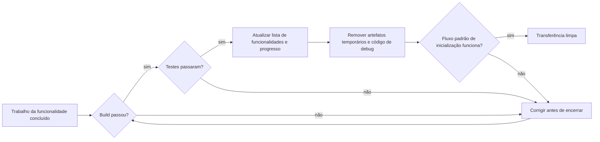
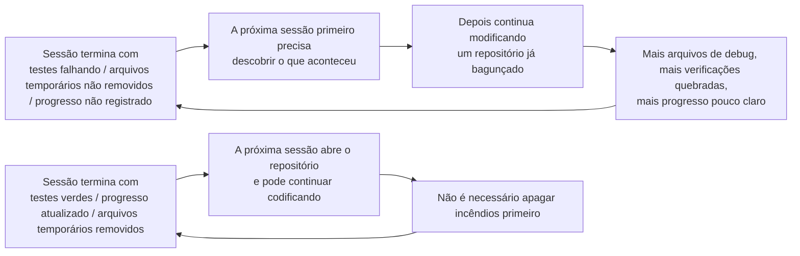

[中文版 →](../../../zh/lectures/lecture-12-why-every-session-must-leave-a-clean-state/)

> Exemplos de código: [code/](https://github.com/walkinglabs/learn-harness-engineering/blob/main/docs/pt-BR/lectures/lecture-12-why-every-session-must-leave-a-clean-state/code/)
> Projeto prático: [Projeto 06. Construir um Workspace Completo para Agentes](./../../projects/project-06-runtime-observability-and-debugging/index.md)

# Aula 12. Deixe uma Transferência Limpa ao Final de Cada Sessão

Seu agente executa tarefas durante toda a tarde, modifica 20 arquivos, faz commit do código e a sessão termina. A próxima sessão do agente é iniciada e imediatamente descobre: o build está quebrado, os testes estão falhando, arquivos temporários de debug estão espalhados por toda parte, a lista de funcionalidades não foi atualizada e o progresso está completamente opaco. Os primeiros 30 minutos da nova sessão são gastos inteiramente tentando "descobrir o que a sessão anterior realmente fez".

Tanto a OpenAI quanto a Anthropic afirmam claramente: **a confiabilidade de longo prazo depende de disciplina operacional, não apenas de sucesso em uma única execução.** A qualidade do estado ao final de cada sessão determina diretamente a eficiência da próxima sessão.

## O Crescimento da Entropia É o Estado Padrão

As leis da evolução de software de Lehman nos dizem que sistemas submetidos a mudanças contínuas inevitavelmente se tornam mais complexos, a menos que sejam gerenciados ativamente. Isso é especialmente verdadeiro para agentes de IA que escrevem código. Cada sessão introduz mudanças e, sem uma limpeza ao final, a dívida técnica se acumula exponencialmente.

Durante cinco meses de experimentos com o Codex, a OpenAI observou algo marcante: **os agentes copiam padrões já presentes no repositório, mesmo quando esses padrões são inconsistentes ou subótimos.** Com o tempo, essa cópia inevitavelmente leva à deriva. A primeira pessoa deixa uma xícara de café na área comum; a segunda pensa "já está bagunçado mesmo" e deixa outra; uma semana depois a mesa está coberta de xícaras. Uma base de código funciona da mesma forma.

A equipe da OpenAI inicialmente gastava 20% de todas as sextas-feiras limpando manualmente a "bagunça de IA", mas essa abordagem claramente não escala. Eles eventualmente chegaram a uma solução sistemática:

1. **Codifique as "regras de ouro" no repositório**: Regras como "prefira o pacote utilitário compartilhado em vez de helpers ad hoc criados manualmente" (mantenha os invariantes centralizados) e "não faça suposições aleatórias sobre estruturas de dados" (valide os limites ou dependa de SDKs tipados). Essas regras são concretas, mecânicas e verificáveis automaticamente.

2. **Estabeleça fluxos periódicos de limpeza**: Uma frota de tarefas em segundo plano do Codex que regularmente procura desvios, atualiza métricas de qualidade e abre PRs de refatoração direcionados. A maioria pode ser revisada e mesclada automaticamente em menos de um minuto.

3. **Capture o julgamento humano uma vez e aplique-o continuamente**: Comentários de revisão, PRs de refatoração e bugs voltados ao usuário são todos convertidos em atualizações de documentação ou codificados diretamente nas ferramentas. Quando a documentação não é suficiente, transforme a regra em código.

Dívida técnica é um empréstimo com juros altos. Pagá-la continuamente em pequenos incrementos quase sempre é melhor do que deixá-la acumular até se transformar em um único evento gigantesco de pagamento.

> Fonte: [OpenAI: Engenharia de Harness: aproveitando o Codex em um mundo centrado em agentes](https://openai.com/index/harness-engineering/)

## Estado Limpo: Mais do Que "O Código Compila"

Estado limpo não significa apenas "o código compila". Construir sem erros é o requisito mais básico — a próxima sessão não deveria precisar corrigir erros de build primeiro. Todos os testes também devem passar, incluindo os testes que já existiam antes da sessão; a sessão é responsável por não quebrar funcionalidades existentes. E isso deve ser verificado na CI, não apenas com um "funciona na minha máquina".



Mas isso ainda não é suficiente. O progresso atual precisa ser registrado em artefatos legíveis por máquina: subtarefas concluídas com seus critérios de aprovação atendidos, subtarefas em andamento mas ainda incompletas com seu estado atual, e subtarefas que ainda não foram iniciadas. Bons registros de progresso podem reduzir o tempo de diagnóstico no início de uma sessão em 60–80%.

Artefatos temporários — logs de depuração, arquivos temporários, código comentado, marcadores TODO — também devem ser removidos, pois aumentam a carga cognitiva da próxima sessão. O fluxo padrão de inicialização também deve continuar funcionando. A próxima sessão consegue começar a trabalhar sem intervenção manual? Inicialização do ambiente, carregamento da base de código, aquisição de contexto e seleção de tarefas — nenhum desses caminhos pode estar quebrado.



## Conceitos Fundamentais

* **Estado limpo (Clean state)**: O sistema deve satisfazer cinco condições ao final da sessão — build aprovado, testes aprovados, progresso registrado, ausência de artefatos obsoletos e caminho de inicialização funcional. Se qualquer uma delas estiver ausente, a sessão não está "concluída".
* **Integridade da sessão (Session integrity)**: Análoga a transações de banco de dados — ou você faz commit completo e deixa um estado limpo, ou faz rollback para o último estado consistente. Não existe meio-termo.
* **Documento de qualidade (Quality document)**: Um artefato ativo que registra continuamente avaliações de qualidade para cada módulo. Não é uma análise pontual, mas um rastreador que mostra se a base de código está se tornando mais forte ou mais fraca ao longo do tempo.
* **Loop de limpeza (Cleanup loop)**: Uma sessão regular de manutenção voltada para reduzir sistematicamente a entropia da base de código. Não é uma correção emergencial, mas uma operação rotineira.
* **Simplificação do harness (Harness simplification)**: À medida que as capacidades dos modelos evoluem, remova periodicamente componentes do harness que já não são mais necessários. Uma restrição essencial hoje pode ser apenas sobrecarga desnecessária daqui a três meses.
* **Limpeza idempotente (Idempotent cleanup)**: Operações de limpeza produzem o mesmo resultado independentemente de quantas vezes sejam executadas, garantindo que permaneçam seguras mesmo em cenários de falha e nova tentativa.

## "Limpar Depois" Significa Nunca Limpar

A armadilha mental mais comum é pensar: "não tenho tempo para limpar nesta sessão, farei isso na próxima". Mas a próxima sessão do agente não sabe o que você deixou para trás — ela vê apenas uma mistura de código e um estado incerto. Ela gastará um tempo significativo tentando inferir "quais partes deste código são intencionais e quais são temporárias".

Pior ainda, cada sessão possui seus próprios objetivos. A nova sessão está ali para realizar trabalho novo, não para limpar a bagunça da sessão anterior. Ela ignorará o caos e começará a trabalhar por cima dele, introduzindo ainda mais caos. Esse é o ciclo de retroalimentação positiva da entropia.

Os números contam a história. Um projeto desenvolvido com agentes durante 12 semanas, sem estratégia de limpeza:

- Semana 1: taxa de sucesso do build 100%, taxa de sucesso dos testes 100%, inicialização de nova sessão em 5 min
- Semana 4: build 95%, testes 92%, inicialização em 15 min
- Semana 8: build 82%, testes 78%, inicialização em 35 min
- Semana 12: build 68%, testes 61%, inicialização em mais de 60 min

O mesmo projeto com uma estratégia de limpeza:

- Semana 1: 100%, 100%, 5 min
- Semana 12: 97%, 95%, 9 min

Após 12 semanas: a taxa de sucesso do build difere em 29 pontos percentuais e o tempo de inicialização de uma nova sessão difere em 85%. Isso não é teórico — é uma diferença observada.

## Como Fazer

### 1. Estado Limpo É uma Condição Necessária para Conclusão

Defina explicitamente no harness: **conclusão da sessão = tarefa aprovada na verificação E verificação de estado limpo aprovada.** A ausência de qualquer um dos dois significa que a sessão não está concluída. Escreva no `CLAUDE.md`:

```text
## Checklist de Encerramento da Sessão
- [ ] Build aprovado (npm run build)
- [ ] Todos os testes aprovados (npm test)
- [ ] Lista de funcionalidades atualizada
- [ ] Nenhum código de debug restante (console.log, debugger, TODO)
- [ ] Caminho padrão de inicialização disponível (npm run dev)
```

### 2. Estratégia de Limpeza em Dois Modos

Combine dois modos de limpeza:

**Limpeza imediata (ao final de cada sessão)**: Remova artefatos temporários criados durante a sessão, atualize o estado da lista de funcionalidades e garanta que build e testes estejam aprovados. Essa é uma limpeza por "contagem de referências" — limpe assim que terminar de usar algo.

**Limpeza periódica (semanal)**: Varredura completa do sistema — trate problemas estruturais acumulados, atualize documentos de qualidade e execute testes de benchmark para detectar desvios. Essa é uma limpeza por "rastreamento" — uma manutenção abrangente realizada em uma cadência regular.

### 3. Mantenha um Documento de Qualidade

Um documento de qualidade é um artefato ativo que avalia continuamente cada módulo:

```markdown
# Documento de Qualidade

## Módulo de Autenticação de Usuários (Qualidade: A)
- Verificação aprovada: Sim
- Compreensível para agentes: Sim
- Estabilidade dos testes: Estável
- Limites arquiteturais: Em conformidade
- Convenções de código: Seguidas

## Módulo de Pagamentos (Qualidade: C)
- Verificação aprovada: Parcial (callback de pagamento não testado)
- Compreensível para agentes: Difícil (lógica espalhada em 3 arquivos)
- Estabilidade dos testes: Instável (2 testes flakey)
- Limites arquiteturais: Violações presentes
- Convenções de código: Parcialmente seguidas
```

Novas sessões leem esse documento e sabem imediatamente onde priorizar esforços. Corrija primeiro o módulo com a menor pontuação.

### 4. Simplifique Periodicamente o Harness

Todo componente do harness existe porque o modelo não conseguia realizar algo de forma confiável sozinho. Mas, à medida que os modelos evoluem, essas premissas ficam desatualizadas.

Os experimentos da Anthropic demonstraram isso diretamente. O harness inicial incluía um mecanismo de divisão de sprints — quebrando o trabalho em pequenas partes para que o Sonnet 4.5 pudesse concluí-las uma por vez. Quando o Opus 4.6 foi lançado, as capacidades nativas do modelo passaram a lidar autonomamente com a decomposição do trabalho, tornando a construção de sprints uma sobrecarga desnecessária. Após sua remoção, o agente construtor conseguiu trabalhar continuamente por mais de duas horas sem perder o foco — e de forma mais fluida.

Mas o avaliador contou uma história diferente. Mesmo com as capacidades mais fortes do Opus 4.6, quando as tarefas se aproximavam do limite de capacidade do modelo, o avaliador continuava agregando valor real — detectando funcionalidades ausentes e implementações simuladas deixadas pelo gerador. Isso significa que o avaliador não é uma decisão fixa de sim ou não; sua utilidade depende de quão próxima a dificuldade da tarefa está da capacidade do modelo.

**Prática recomendada**: A cada mês, escolha um componente do harness, desative-o temporariamente e execute tarefas de benchmark. Se os resultados não piorarem, remova-o permanentemente. Se piorarem, restaure-o ou substitua-o por uma alternativa mais leve.

Um princípio mais profundo: **à medida que os modelos evoluem, as combinações interessantes em um harness não diminuem — elas mudam.** Problemas que antes exigiam soluções explícitas são absorvidos pelas capacidades dos modelos, mas novos limites de capacidade abrem espaços de design de harness que antes eram impossíveis. O trabalho do engenheiro de IA é encontrar continuamente a próxima combinação valiosa.

### 5. Operações de Limpeza Devem Ser Idempotentes

Scripts de limpeza devem ser seguros para execução repetida — executá-los mais uma vez não deve produzir efeitos colaterais:

```bash
# Operações de limpeza idempotentes
rm -f /tmp/debug-*.log  # -f garante ausência de erro quando arquivos não existem
git checkout -- .env.local  # Restaurar para um estado conhecido
npm run test  # Verificar se a limpeza não quebrou nada
```

### 6. Alta Vazão Muda a Filosofia de Merge

Quando a produção dos agentes excede em muito a capacidade humana de revisão, a filosofia tradicional de merge precisa ser ajustada. A experiência da equipe da OpenAI foi a seguinte: em um ambiente onde um agente abre 3,5 PRs por dia (e posteriormente ainda mais), minimizar bloqueios para merge é a decisão correta. Os PRs devem ter vida curta; instabilidades em testes geralmente são resolvidas em execuções subsequentes, em vez de bloquear indefinidamente o progresso. Em um sistema onde o custo de corrigir é baixo e o custo de esperar é alto, avançar rapidamente com correções rápidas é uma estratégia melhor do que confirmações lentas.

**Ressalva**: Isso é irresponsável em um ambiente de baixa vazão. Mas quando a produção dos agentes excede em muito a atenção humana disponível, geralmente é a troca correta. O critério principal é: **custo médio para corrigir um bug versus custo médio de esperar um humano revisar um PR.** Quando o primeiro é menor que o segundo, realizar merges rapidamente é a decisão correta.

## Caso Real

Um aplicativo Electron desenvolvido com agentes durante 12 semanas, comparando duas abordagens:

**Sem estratégia de limpeza** (grupo de controle): Semana 12, taxa de sucesso do build de 68%, taxa de sucesso dos testes de 61%, inicialização de nova sessão em mais de 60 minutos, 103 artefatos obsoletos.

**Com estratégia de limpeza** (grupo experimental): Verificação completa de estado limpo ao final de cada sessão, além de um loop semanal de limpeza. Na semana 12, taxa de sucesso do build de 97%, taxa de sucesso dos testes de 95%, inicialização de nova sessão em 9 minutos, 11 artefatos obsoletos.

Na semana 12, a taxa de sucesso do build do grupo experimental era 29 pontos percentuais maior, a taxa de sucesso dos testes era 34 pontos maior e o tempo de inicialização de novas sessões era 85% menor. Cada sessão gastava cerca de 5 minutos extras com limpeza, mas ao longo de 12 semanas isso economizou dezenas de horas de caos.

## Principais Conclusões

- **Estado limpo é uma condição necessária para concluir uma sessão** — não é uma tarefa opcional de organização, mas parte da própria "definição de concluído".
- **As cinco dimensões são inegociáveis** — build, testes, progresso, artefatos e inicialização — cada uma deve ser verificada explicitamente.
- **Documentos de qualidade tornam a saúde da base de código rastreável** — só é possível corrigir proativamente aquilo cuja degradação você consegue observar.
- **Simplifique periodicamente o harness** — à medida que as capacidades dos modelos evoluem, remova restrições que não são mais necessárias.
- **"Limpar depois" equivale a nunca limpar.** O crescimento da entropia é o estado padrão; apenas a limpeza ativa consegue combatê-lo.

## Leitura Complementar

- [Clean Code - Robert C. Martin](https://www.goodreads.com/book/show/3735293-clean-code) — Princípios sistemáticos de limpeza de código
- [Harness Engineering - OpenAI](https://openai.com/index/harness-engineering/) — Reprodutibilidade como requisito central de design de harness
- [Effective Harnesses - Anthropic](https://www.anthropic.com/engineering/effective-harnesses-for-long-running-agents) — O papel crítico de encerramentos limpos de sessão para confiabilidade de longo prazo
- [Programs, Life Cycles, and Laws of Software Evolution - Lehman](https://ieeexplore.ieee.org/document/1702314) — Leis da evolução de software que demonstram como a complexidade dos sistemas cresce inevitavelmente sem manutenção ativa

## Exercícios

1. **Checklist de Estado Limpo**: Crie um checklist de encerramento de sessão para sua base de código cobrindo as cinco dimensões. Aplique-o em 5 sessões consecutivas e registre o número de violações por dimensão.

2. **Comparação por Benchmark**: Utilize um conjunto fixo de tarefas com duas variantes de harness (com e sem requisitos de estado limpo). Compare taxa de conclusão, número de tentativas e taxa de defeitos que escaparam para produção.

3. **Prática de Simplificação do Harness**: Escolha um componente do harness, desative-o temporariamente e execute tarefas de benchmark. Compare os resultados com e sem ele. Decida se deve mantê-lo, removê-lo ou substituí-lo.
