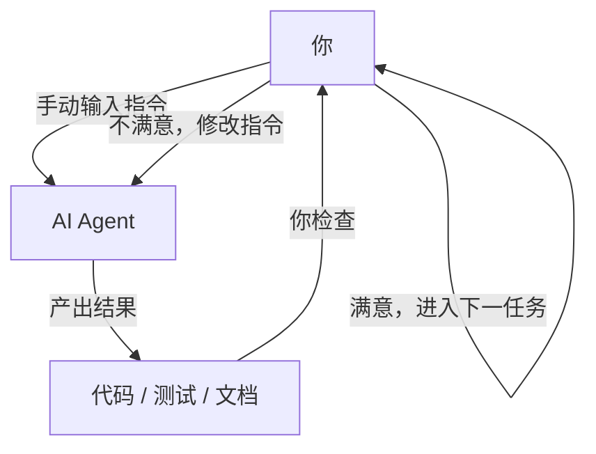
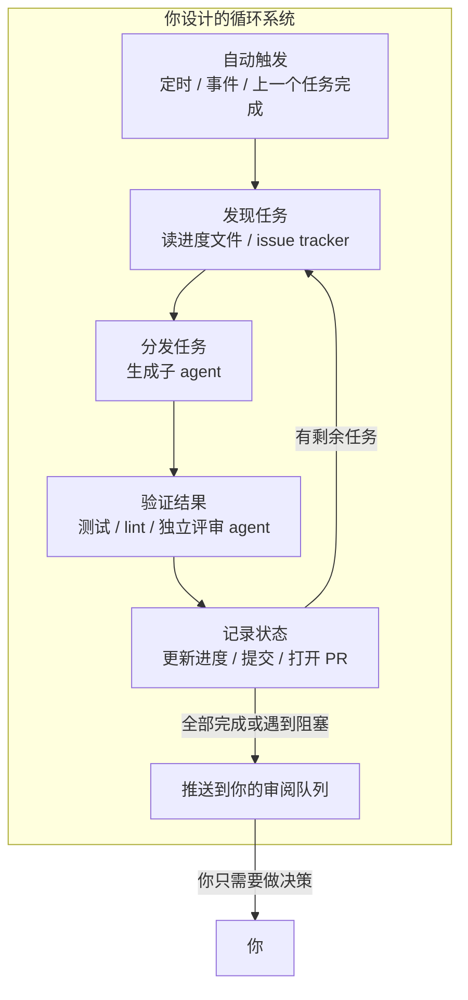
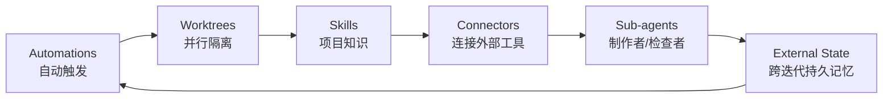
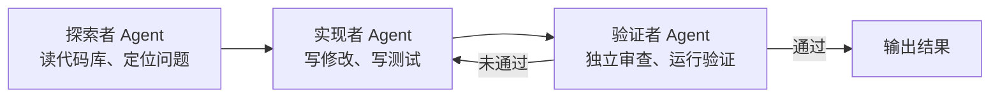
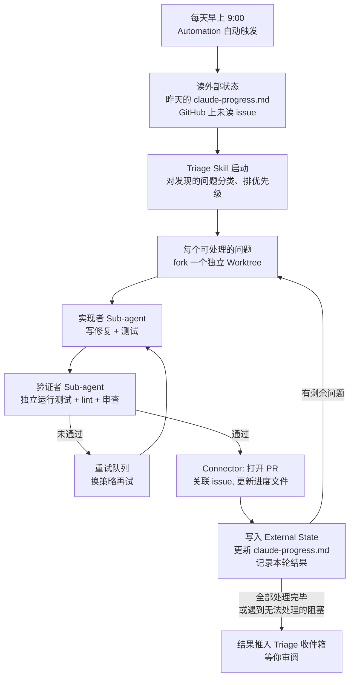
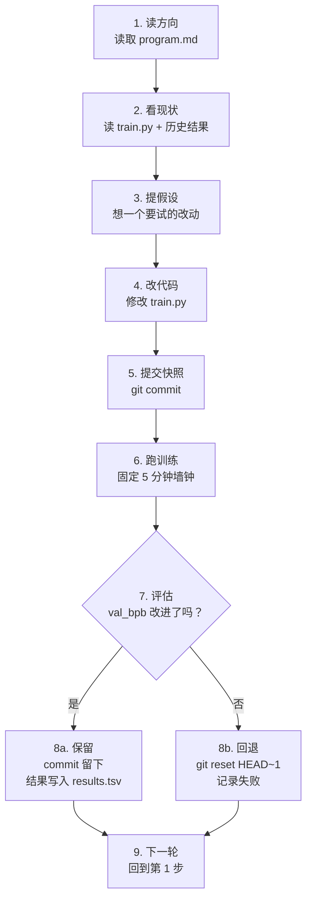

[English Version →](../../../en/lectures/lecture-13-loop-engineering/)

> 本篇代码示例：[code/](https://github.com/walkinglabs/learn-harness-engineering/blob/main/docs/zh/lectures/lecture-13-loop-engineering/code/)
> 实战练习：[Project 07. 搭建你的第一个自动循环](./../../projects/project-07-loop-engineering-first-loop/index.md)

# 第十三讲. 从手动驱动到自动循环

前十二讲，你做的事情始终有一个共同前提：**你坐在键盘前，一次一次地输入指令。**

你写好了 `AGENTS.md`（第一到四讲），建立了状态管理（第五、六讲），用功能清单约束范围（第七、八讲），让 agent 在结束时留下干净交接（第九、十二讲），让运行过程可观测（第十、十一讲）——但所有这些工作的触发者，始终是你。agent 不会自己决定什么时候该干活，因为没有人按下"开始"按钮。

这一讲要讨论的，就是怎么把"按按钮"这件事也交给系统。不是放弃控制，而是把控制升到更高一层。

## /goal：最简形态的 loop

理解 loop engineering，最好的入口不是一套复杂的架构图，而是一个具体的命令。

2026 年初，Claude Code 和 OpenAI Codex 不约而同地加入了同一个功能：`/goal`。你在终端里敲：

```
/goal "所有测试通过，lint 零告警，合并到 main"
```

然后合上笔记本去睡觉。八小时后醒来，agent 已经自己完成了分析、编码、测试、修复、合并的全过程。它失败了就重试，方向错了就换策略，通过了就结束——不需要你坐在旁边说"再试一次试试"。

`/goal` 和传统 prompt 的区别只有一点，但这一点改变了一切：

| | 传统 prompt | `/goal` |
|---|---|---|
| 你给什么 | 下一步具体做什么 | 最终状态是什么 |
| agent 做什么 | 执行一次 | 循环直到达成 |
| 谁判断做完了 | 你 | 一条可验证的停止条件 |
| 你什么时候可以走 | 不能走 | 给完 `/goal` 就行 |

`/goal` 本质上就是一个 loop。它的结构只有三样东西：**一个目标，一种验证方式，一条停止条件。** 但就是这三样东西，让你的位置从循环**里面**移到了循环**外面**。

### `/goal` 是怎么长出来的

`/goal` 不是某天突然从 0 跳到 1 的。它是从日常工作流里一点一点长出来的，大致经历了四个阶段：

**阶段一：手动一条一条输。** 最早的用法就是你一句我一句，"写个函数"、"加个测试"、"改一下这个逻辑"。agent 每执行一步就停下来等你说下一步。你是整个流程的调度器。

**阶段二：长 prompt + 多步骤。** 后来大家开始写更长的 prompt，把多个步骤写在一起："先分析代码，再写实现，再跑测试，测试没过就修。"agent 可以一口气跑好几步了，但你还是得盯着——因为它可能在某一步跑偏，或者跑完了不知道下一步该干嘛。

**阶段三：agent 自己判断要不要继续。** 再往后，agent 有了"自省"能力——跑完一步自己看结果，决定下一步怎么走。你给一个目标，它自己拆步骤、自己重试。但问题来了：它什么时候停？它自己说"我做完了"算不算数？实践反复证明——不算数。agent 太容易宣告胜利了。

**阶段四：独立的停止判断——`/goal`。** 最后一步是把"判断做完了没有"这件事，从干活的 agent 手里拿出来，交给一个独立的判断者。可能是另一个模型、可能是一段脚本、可能是一条测试命令，但总之——不能让写代码的人自己批作业。到这一步，`/goal` 才真正成立：你给目标，它循环跑，独立判断停不停，你可以走人。

这四个阶段不是某家公司规划好的路线图，是全世界用 agent 写代码的人，在各自的日常里，被同一个痛点推着，一步一步走到了同一个地方。Claude Code 和 Codex 在 2026 年初几乎同时上线 `/goal`，不是巧合——是时候到了。

### Loop 不只有一种

`/goal` 是最容易理解的 loop，但它不是唯一的一种。按触发方式和停止方式的不同，loop 可以分成几类：

| 类型 | 触发方式 | 停止方式 | Claude Code | Codex | 适用场景 |
|------|---------|---------|------------|-------|---------|
| **回合制 loop** | 你手动输入每一条 prompt | agent 认为做完了，或者你打断 | 普通对话 | 普通对话 | 小任务、探索性工作 |
| **目标驱动 loop** | 你给一个目标 | 独立判断者确认达成，或达到最大回合数 | `/goal` | `/goal`（需手动开启） | 有明确完成标准的复杂任务 |
| **时间驱动 loop** | 定时触发（每隔 N 分钟/小时） | 你手动停止，或任务完成后自行退出 | `/loop` | 对话线程自动化（Thread automation） | 轮询状态、定期巡检、重复性工作 |
| **事件驱动 loop** | 外部事件触发（PR 提交、CI 失败、新 issue） | 处理完事件就停，或达到重试上限 | Routines (API / GitHub Webhook) | 独立自动化任务 + 插件 | 响应式工作流、CI/CD 集成 |

这几种 loop 不是互相取代的关系，而是工具箱里的不同工具。小任务用回合制就够了；有明确终点的用 `/goal`；需要盯着什么东西的用 `/loop`；要和外部系统联动的用事件驱动。

### `/goal` 和 `/loop` 别搞混

名字里都带 "loop"，但它们解决的是完全不同的问题：

| | `/goal` | `/loop` |
|---|---------|---------|
| **本质** | 一个大任务，跑到完为止 | 同一个小动作，按间隔重复跑 |
| **停止条件** | 目标达成了，或者预算花完了 | 你手动停，或者任务做完自己退 |
| **时间特征** | 一次长跑，可能跑几小时甚至几天 | 周期性短跑，每次可能只跑几分钟 |
| **状态累积** | 任务越跑越接近终点 | 每次都是独立的，不累积进度 |
| **类比** | 跑马拉松——发令枪响了就跑，撞线就停 | 闹钟——每隔一段时间响一次，你关了才停 |
| **典型用法** | "实现整个支付系统，有测试覆盖" | "每 15 分钟看一眼 CI 挂了没" |

一个容易犯的错：把该用 `/goal` 的事情塞进 `/loop` 里。比如你写 `/loop 10m "继续实现支付系统"`——这是错的。因为 `/loop` 每次都是独立跑一遍指令，不会记得上次做到哪了，结果就是每次都从同一个地方重新开始。

**判断该用哪个的一句话标准：这件事有终点吗？**
- 有终点 → `/goal`
- 没终点，就是要一直盯着 → `/loop`

本讲讲的 Loop Engineering，核心不是某一个命令，而是**当你需要的时候，能设计出包含以上所有类型的系统——让 agent 在你不在场的时候也能自己跑。**

你不必每次都写 `/goal`。但理解它从哪来、为什么长这样，就理解了 loop engineering 的核心——更复杂的 loop 只是在三样基础（目标、验证、停止）之上，加上了调度、并行、隔离、记忆这些零件。

## 2026 年 6 月，三个人在同一周点了一把火

2026 年 6 月第一周，三位构建 coding agent 基础设施的核心人物，在没有通气的情况下，说了同一句话的不同版本。

**Peter Steinberger**（OpenClaw 作者，[其推文收获 800 万浏览](https://x.com/steipete/status/2063697162748260627)）：「你不应该再给 coding agent 写 prompt 了。你应该设计循环去 prompt 你的 agent。」

**Boris Cherny**（Anthropic Claude Code 负责人，[在 Acquired 播客上](https://x.com/rohanpaul_ai/status/2063289804708835412)）：「我已经不手动 prompt Claude 了。我有一堆循环在跑，它们负责 prompt Claude、搞清楚要做什么。我的工作变成了写循环。」

**Addy Osmani**（Google Chrome 工程负责人）在 6 月 7 日[撰文](https://addyosmani.com/blog/loop-engineering/)将这个概念命名为 **Loop Engineering**，并给了它一句话定义：

> **Loop engineering 就是用系统取代你自己去 prompt agent。**

Cherny 透露了一个数字：在连续 30 天里，Claude Code 的所有代码贡献全部由 AI 自主完成，累计合并 259 个 PR，其中超过 80% 的生产代码由 Claude 编写，开放式软件任务成功率达到 76%。

三个人、同一周、同一个结论。不是因为商量好的，是因为基础设施刚好跨过了一个门槛：agent 已经可靠到能独立完成非 trivial 任务、调度原语（`/loop`、`/goal`、cron）已经内置于工具中、单次运行的 token 成本也低到值得反复跑。当零件全部就位，把零件拼在一起的动作，所有人在同一时间想到了。

> 来源：[Addy Osmani: Loop Engineering](https://addyosmani.com/blog/loop-engineering/)

## 你在循环里面 vs 你在循环外面

让我们用两个具体的场景对比。

**场景 A：你在循环里面（前十二讲的模式）**



你有完整的 harness：`AGENTS.md` 告诉 agent 项目规则，`feature_list.json` 约束了范围，`init.sh` 保证环境一致，`claude-progress.md` 记录进度。**但每一步仍需你手动发起。** 做完一个 feature，你要读进度文件，想一下下一个做什么，再输入指令。你是整个工作流的引擎。

**场景 B：你在循环外面（Loop Engineering）**



你不输入指令了。你设计的系统去发现任务、分发任务、验证结果、记录状态、决定下一步。你做的事情变成了三件：**在开始前定义目标和停止条件，在结束后审阅结果，在系统跑偏时调整规则。** 价值杠杆从"写对 prompt"转移到了"设计对的循环"。

> Addy Osmani 的原话：「一年前如果你想搞一个 loop，你得写一堆 bash 脚本然后永远维护它。现在这些零件已经直接内置于产品中了。」你不需要重造轮子，你需要的是理解这些零件怎么拼在一起。

## 核心概念

- **Loop Engineering**：设计一个系统来自动向 agent 发指令，取代人手动逐条输入。人从循环里面移到循环外面，价值杠杆从"写对 prompt"转移到"设计对的循环"。
- **`/goal` 模式**：最简形态的 loop——给出目标、验证方式和停止条件，agent 循环直到达成。是从手动驱动到自动循环的桥梁。
- **Generator/Evaluator 分离**：写代码的 agent 和检查代码的 agent 必须分开。同一个模型给自己打分是不可信的；独立的、有时甚至用不同模型的验证者是 loop 可靠性的底线。
- **Worktree 隔离**：每个并行 agent 在独立的 git worktree 中工作，物理上避免文件碰撞。是多 agent 并行运行的基础设施前提。
- **外部状态（External State）**：活在单次对话之外的记忆载体——markdown 文件、issue tracker、看板等。模型在会话之间什么都不记得，记忆必须在磁盘上。
- **六种沉默成本**：loop 跑得越久越尖锐的四类隐性成本——验证负债、理解腐烂、认知投降、令牌爆炸。loop 加速的不仅是产出，也包括风险。

## 一个 Loop 的六大原语

Osmani 将构成 loop 的零件归纳为五个核心组件，外加一个贯穿始终的记忆层——一共六样东西，但记忆层的地位是特殊的：它不是一个和其他零件平级的组件，而是其他所有零件都依赖的脊柱。

下面这张图把六样东西画成一个环，方便你一眼看全。但要记住：External State 不是环上的一站，它是整个环的地基。



### 1. Automations（自动触发）

没有自动触发，loop 就不是 loop，只是你手动跑了一次。

Claude Code 和 Codex 都有完整的调度体系，但叫法和分层不太一样。从轻到重大致可以这样对应：

| 层级 | Claude Code | Codex | 说明 |
|------|------------|-------|------|
| 会话内轮询 | `/loop` | 对话线程自动化（Thread automation） | 跟着当前会话走，关了就没了 |
| 本地定时任务 | Desktop 定时任务 | 独立自动化任务（本地模式） | 机器开着就跑，能读本地文件 |
| 云端定时任务 | Cloud Routines | —（Codex 无云原生调度） | 机器关了也跑 |
| 事件触发 | Routines (API / GitHub Webhook) | 独立自动化任务 + 插件 | 外部事件触发 |
| 完全自建 | GitHub Actions / 自建 cron | `codex exec` + cron | 完全自己掌控 |

**Codex 的 Automations 面板**是它的调度入口。在里面选项目、写好 prompt、设好频率、选在本地工作区还是后台 worktree 跑。找到东西的结果进入 Triage 收件箱；没找到东西的自动归档。OpenAI 内部用它做日常：issue 分类、CI 失败总结、commit 简报、追溯上周引入的 bug。

Codex 的自动化分两种：
- **对话线程自动化（Thread automation）** — 心跳式重复唤醒同一个线程，保留上下文。适合盯着一件事持续跟进，比如监控一个长命令、轮询 PR 状态。对应 Claude Code 的 `/loop`。
- **独立自动化任务（Standalone automation）** — 每次启动全新运行，结果进入 Triage。适合每天/每周独立执行的任务，比如每日简报、依赖扫描。对应 Claude Code 的 Desktop 定时任务。

Claude Code 的体系分得更细：

- **`/loop`** — 会话内的轻量定时循环。终端开着的时候有效，关了就没了，7 天自动过期。适合当前工作 session 里临时需要盯着什么东西的时候。
- **Desktop 定时任务** — 机器开着就跑，会话关了也不受影响，间隔可以到分钟级。适合需要访问本地文件的重复性工作。
- **Cloud Routines** — 跑在 Anthropic 的云上，你的机器关了也不影响，最小间隔 1 小时。支持三种触发器：定时、API 调用、GitHub Webhook。适合不需要本地环境的日常任务。
- **GitHub Actions / 自建 cron** — 完全自己掌控，想怎么跑怎么跑。适合有特殊环境要求或安全限制的场景。

```bash
# Claude Code：每 30 分钟跑一次测试并修复（当前会话内有效）
/loop 30m Run the test suite and fix any failing tests

# Claude Code：每 15 分钟检查一次部署状态
/loop 15m Check if the production deploy succeeded and report status
```

Automations 是这个系统的"心跳"。没有它，loop 就只是个设计图，从来不会自己运转。

### 2. Worktrees（并行隔离）

一旦有超过一个 agent 同时跑，文件碰撞就变成必然的失败模式。两个 agent 同时改同一个文件，就像两个工程师没有沟通就提交了同一段代码。

`git worktree` 解决的就是这个：每个 agent 在自己的独立分支上工作，物理上不可能碰到别人的修改。

Claude Code 和 Codex 都内置了 worktree 支持。当你用 `--worktree` 或 `isolation: worktree` 启动子 agent 时，每个 helper 拿到一个干净的、独立的 checkout，完成任务后自行清理。worktree 移除了碰撞的机械问题，但你要记住：**你的审阅带宽仍然是天花板**，你能同时盯多少个并行 agent，决定了你能跑多少个 worktree。

### 3. Skills（项目知识）

Skill 让你不再每次会话都重新解释一遍你的项目。它是一个文件夹，里面有 `SKILL.md` 存放指令和元数据，外加可选的脚本、参考文档、资源文件。

Codex 和 Claude Code 都支持相同的格式。skill 通过 `/skill-name` 直接调用（Codex 也支持 `$skill-name`），也可以在 agent 判断任务匹配时自动触发。

技能本质上是在 pay 你的 intent debt——一个 agent 每次启动时都是"冷"的，你上下文里没写的东西，它就用自信的猜测填补。skill 就是把你的意图写在外面，写一次，每次运行都读。

### 4. Connectors（插件与连接器）

一个只能看到文件系统的 loop 是个小 loop。Connectors（基于 MCP 协议）让 agent 能读 issue tracker、查数据库、调 staging API、往 Slack 发消息。

Codex 和 Claude Code 都支持 MCP，你为一个工具写的 connector 通常另一个也能直接用。Connectors 的区别在于：有了它，agent 不只是说"这是修复方案"，而是自动打开 PR、关联 Linear ticket、在 CI 通过后 ping 频道——loop 在你的真实环境里行动，不只是在终端里打字。

### 5. Sub-agents（子 agent）

loop 里最有结构价值的设计，就是把"写的人"和"检查的人"分开。写代码的模型对自己的作业评分太宽容了。第二个 agent，用不同的指令、有时用不同的模型，能抓住第一个 agent 自我说服的东西。

典型的三人分工：



Claude Code 的 `/goal` 底层就是这么干的——一个独立的小模型来判断 loop 是否应该停止，而不是让写代码的那个模型自评。这被称为 **generator/evaluator 分离**，是 loop 可靠性的核心保障。

### 6. External State（外部状态）

模型在会话之间什么都不记得。记忆必须在磁盘上，不能在上下文窗口里。

这听起来太简单而不值得提，但它是每个长时间运行的 agent 都依赖的同一个把戏。一个 markdown 文件、一个 Linear 看板——任何活在单次对话之外的东西，记录了什么做完了、什么正在做、什么被阻塞了。agent 忘了一切，仓库不会忘。

这六个原语拼在一起，就是你的 loop 设计工具箱。你不需要每次都全用上，但你需要知道什么时候该用哪一个。

## 一个 Loop 的完整解剖

把六个原语拼在一起，看一个真实的 morning triage loop：



这不再是一个 agent 的一次运行。它是一个持续运转的系统，每天早上自己醒来，自己扫地，自己把需要你关注的东西放到你面前。你的角色变成了：**审阅 inbox 的内容，做决策，遇到系统处理不了的模式就优化 skill 或规则。**

Cherny 用这个模式让 Claude Code 团队在 30 天内合并了 259 个 PR，自己一次都没有打开 IDE。OpenAI 的工程师用同样的模式创建了约一百万行代码的 beta 产品，一行都没有手写。

## Generator/Evaluator 分离：为什么不能让自己批自己作业

这是 loop engineering 中最硬核的一条教训。

你让你最聪明的 agent 写了一段漂亮的代码。代码逻辑清晰、注释完整、测试全覆盖。你很满意。

但你有没有想过一个问题：**如果让那个写了代码的 agent 自己来评判自己做得对不对，它会说什么？**

答案已经被实践反复验证：它会给自己打高分。不是因为它不诚实，而是因为它就是这段代码的作者——它在生成的时候已经说服自己这条路是对的。你让它回头看，它看到的不是错误，而是自己的推理过程。

这不是 Claude 的问题，不是 GPT 的问题，这是所有生成式模型的共同特性。**模型是它自己输出最好的辩护律师。**

解决方案就是：永远不用同一个人（同一个模型、同一个 prompt）既干活又检查。

- Claude Code 的 `/goal` 底层的 supervisor 是一个独立的 session，独立判断是否达成目标
- Codex 的 subagent 体系让你定义验证 agent 可以和实现 agent 用不同模型、不同 reasoning effort
- 社区实践里的"adversarial verify"模式：每一个发现用 N 个独立的质疑 agent 来反驳它，多数否决则丢弃

这个原则用一句话总结：**你的人里必须有一个不信你的。**

## Karpathy 的 autoresearch：Loop 的最佳示范

如果想看一个设计精良、真实跑通的 loop 长什么样，Andrej Karpathy 的 [autoresearch](https://github.com/karpathy/autoresearch) 是最好的教材。

2026 年 3 月，Karpathy 发布了一个 630 行 Python 的项目。给它一张 GPU、一份研究方向，它能自己跑一整夜，完成上百个 ML 训练实验，只保留真正有改进的。项目上线几天内获得 66,000+ star。

### 三个文件，三种角色

整个系统只有三个核心文件，但分工极其清晰：

| 文件 | 谁来改 | 作用 |
|------|--------|------|
| `prepare.py` | 没有人（只读） | 数据准备、tokenizer、评估函数。固定的基础设施。 |
| `train.py`（~630 行） | **AI Agent** | 模型定义、优化器、训练循环。Agent 的实验场，想改什么改什么。 |
| `program.md` | **你** | 用自然语言写的研究方法论。你只改这个，告诉 agent 怎么探索、怎么评估、什么不能碰。 |

这个三分法是整个设计的精髓：**人不动代码，动方向；agent 不动方向，动代码。** 你的工作从写 Python 变成了"写研究组织文化"。

### 输入：program.md 长什么样

`program.md` 是 loop 的大脑。它不是代码，是一份用 Markdown 写的研究指令。里面大致包含：

- **目标**：优化 `val_bpb`（验证集 bits-per-byte，越低越好）
- **约束**：不能改 `prepare.py`、VRAM 不能超、训练时间固定 5 分钟
- **探索方向**：试试不同的架构、优化器、学习率调度
- **评估规则**：怎么算改进、怎么记录结果、失败了怎么办
- **铁律**：永远不要停。一旦开始循环，就一直跑下去

你给 agent 的启动 prompt 甚至可以短到一句话：

```
看看 program.md，然后开始实验。
```

剩下的全靠 agent 自己读文档、自己做决定。

### 九步棘轮循环

autoresearch 的核心是一个**棘轮（ratchet）**——只能往前走，不能后退。每一轮循环严格按九步走：



每小时大约跑 12 次实验。睡一觉（8 小时）就是约 100 次。Karpathy 自己跑了 2 天，约 700 次实验。

固定 5 分钟墙钟是个关键设计——不管 agent 改了什么，每次实验时间完全一样。这意味着所有结果在同一时间预算下直接可比，不会出现"这个跑久一点所以更好"的争议。

### 输出：你早上起来看到什么

Loop 跑完一夜，你早上打开电脑会看到三样东西：

**1. git 历史（前进的棘轮）**

只有真正改进了的 commit 留在主分支上，失败的全被回滚了。git log 就是一份经过验证的研究日志。

**2. results.tsv（完整的实验记录）**

每一次实验——不管成功失败——都记在里面：

```
timestamp    commit_hash    val_bpb    vram_mb    description
--------- ------------- ---------- ---------- ----------------------------
08:01:12  a1b2c3d       1.234     22100    baseline
08:06:15  d4e5f6g       1.228     22400    increased learning rate by 10%
08:11:20  (reverted)     1.241     21800    switched to GELU activation
08:16:08  h7i8j9k       1.219     23000    added weight decay 0.01
...
```

**3. 一份研究日志（agent 自己写的总结）**

Agent 会在 commit message 里写清楚它试了什么、什么有效、什么无效、下一步打算试什么。你读这些就够了，不用读代码 diff。

### 实际跑出了什么结果

Karpathy 首轮 2 天、约 700 次实验的结果：

- 从约 700 次尝试中筛出了约 **20 个可堆叠的有效改进**
- 将 nanochat 在 8×H100 上复现 GPT-2 水平的训练时间从 **2.02 小时压缩到 1.80 小时**，提速约 **11%**
- 找到的改进包括：学习率调整、优化器微调、激活函数替换、注意力模式优化等

不是所有改进都是惊天动地的大发现吗？不是。大部分是小优化堆叠出来的。但这 20 个有效改进，靠人手动做要花几周——agent 用 48 小时跑完了。

### 最值得注意的细节：loop 是用英文写的，不是用代码。

`program.md` 是一份 Markdown 文档，不是 Python 脚本。它描述了研究方法论——改什么、不改什么、怎么评估、怎么处理失败、以及一条铁律：**禁止向人类求助，一直跑。** 一个 coding agent 读这份文档，然后无限循环执行下去。

这就是 loop engineering 的核心模式：不给 agent 任务，给 agent **方法论**。让方法论成为 loop。一份 `program.md`，630 行胶水代码，剩下的全部是 agent 自己跑。

## 四种沉默成本

loop 跑起来之后，你不会立刻看到问题。以下四种成本会沉默地累积，等到你发现的时候可能已经损失了很多。

### 1. Verification Debt（验证负债）

loop 跑得快的时候，你很容易跳过验证。"看起来没问题"不等于"确实没问题"。loop 里自动生成的代码越多，验证债务积累越快。解决方式是：**停止条件必须是可自动检查的，不能是"感觉差不多"。**

### 2. Comprehension Rot（理解腐烂）

loop 出代码的速度越快，你对自己代码库的理解就越跟不上。Cherny 的团队 80% 的代码是 agent 写的——这意味着一个团队大部分代码不是人写的。如果不读不用，你对系统的理解会持续衰减。**快速跑 loop 的前提是快速读结果。**

### 3. Cognitive Surrender（认知投降）

当 loop 跑得很顺的时候，最舒服的姿势就是不再有观点。来什么接什么，不对结果动脑子。但这恰恰是危险的开始——你在用 loop 逃避思考，而不是用 loop 放大思考。Osmani 的警告：「两个人可以造完全一样的 loop，得到完全相反的结果。一个用它加深理解后加速，另一个用它代替理解。loop 不知道区别，你知道。」

### 4. Token Blowout（令牌爆炸）

loop 的每一次迭代都会积累更多上下文。代码写过了，错误遇到了，决策做过了。如果不做上下文压缩，prompt size 会随着迭代次数近似平方增长。Codex 的解决方案是自动 context compaction——用一个专门的 API 将老的对话轮次压缩成加密的内容摘要，保留关键知识，丢弃冗余细节。这是每个 loop 设计之初就要考虑的工程问题。

## 从零构建你的第一个 Loop

不需要一上来就搭一个 Stripe 级别、每周合并 1,300 个 PR 的系统。从最小可行的版本开始。

### 第一步：选一个重复发生的任务

找一个你每周至少做两次的事情。比如：
- 早上打开 GitHub，看有没有新 issue，分类和回复
- 每次 PR 审核前跑一遍 lint 和测试
- 每天结束前更新进度文档

### 第二步：写一个 goal 和停止条件

把任务变成一个 `/goal` 可以理解的描述：

```markdown
Goal: 检查仓库最新的 10 个 issue。
对于每个 issue：
  - 如果已经有明确标签和负责人，跳过
  - 如果没有标签，根据内容添加标签
  - 如果可以 10 分钟内修复，创建分支并尝试修复
停止条件：所有符合条件的 issue 都已处理，或遇到需要人工决策的问题。
```

### 第三步：拆出 maker 和 checker

不要让同一个 agent 既改代码又判对错。把你的 loop 拆成两个角色：
- 实现者：读 issue、写修复、写测试
- 验证者：独立运行测试、审查 diff、判断这个修复是否真解决了问题

### 第四步：加上记忆

用一个 markdown 文件记录 loop 每次运行的结果。下一轮启动时先读这个文件，知道上一轮做了什么、什么还没做。这比任何复杂的数据库都管用。

### 第五步：设一个定时器

用 `/loop` 命令或操作系统的 cron，让这个 loop 在没有你的时候也能启动。先从每天一次开始，观察一周。

### 成熟度阶梯

你不需要一次到位。loop 的采用是一个阶梯：

1. **Level 1: Goal Runner** — 你会用 `/goal` 下达有停止条件的任务，agent 循环直到达成
2. **Level 2: Scheduled Single-Task** — 一个自动化定时跑一个任务（比如每天早上检查 CI）
3. **Level 3: Multi-Agent Loop** — 实现者和验证者分离，每个发现 fork 一个独立 worktree
4. **Level 4: Self-Feeding Loop** — loop 从外部状态中自动发现下一个任务，自己决定做什么
5. **Level 5: Fleet Orchestration** — 多个 loop 并行运行，彼此独立、共享记忆

绝大多数团队目前卡在 Level 2 到 Level 3 之间。Level 1 是最快能看到回报的一步。

## 核心要点

- **Loop Engineering 不是替代 Harness Engineering，而是在它之上建一层。** harness 保证单次运行可靠，loop 保证持续运行不需要你守在旁边。
- **`/goal` 是最简形态的 loop：** 目标 + 验证方式 + 停止条件。这三样东西让你的位置从循环里面移到循环外面。
- **六个原语（Automations / Worktrees / Skills / Connectors / Sub-agents / External State）是 loop 的零件。** 不是每次都全用，但需要知道什么时候该装哪一个。
- **写代码的人和检查代码的人必须分离。** 一个模型给自己打分是不可信的；独立的、有时甚至用不同模型的验证 agent 是 loop 可靠性的底线。
- **loop 让生成几乎免费，判断成为稀缺资源。** 你省下的时间不是用来歇的，是用来做更多判断的。
- **四种沉默成本会随着 loop 跑得越久越尖锐：** 验证负债、理解腐烂、认知投降、令牌爆炸。loop 加速的不仅是产出，也包括风险。
- **从小开始。** 一个 `/goal`，一个 cron，一个 markdown 记忆文件。看到回报之后再往上加。

## 延伸阅读

- [Addy Osmani: Loop Engineering](https://addyosmani.com/blog/loop-engineering/)
- [Addy Osmani: Agent Harness Engineering](https://addyosmani.com/blog/agent-harness-engineering/)
- [Simon Willison: Designing Agentic Loops (Sep 2025)](https://simonw.substack.com/p/designing-agentic-loops)
- [Karpathy: autoresearch](https://github.com/karpathy/autoresearch)
- [Claude Code: Dynamic Workflows and Orchestration](https://kenhuangus.substack.com/p/claude-code-orchestration-dynamic)
- [Loop Library (Forward Future)](https://signals.forwardfuture.ai/loop-library/) — 50 个真实 loop 的公开语料库
- [The Neuron: Claude Code Creators on Agent Loops](https://www.theneuron.ai/explainer-articles/claude-code-creators-boris-cherny-and-cat-wu-explain-how-to-use-agent-loops/)
- 第十二讲：[每次会话结束前都做好交接](./../lecture-12-why-every-session-must-leave-a-clean-state/index.md) — loop 的前提：每个会话留下干净状态，下一轮才能自动启动
- 第五讲：[让跨会话的任务保持上下文连续](./../lecture-05-why-long-running-tasks-lose-continuity/index.md) — 外部状态和记忆的前置知识
- 第十一讲：[让 agent 的运行过程可观测](./../lecture-11-why-observability-belongs-inside-the-harness/index.md) — loop 跑得越快，越需要可观测性来发现问题
- 第八讲：[用功能清单约束 agent 该做什么](./../lecture-08-why-feature-lists-are-harness-primitives/index.md) — 功能清单是 self-feeding loop 发现下一个任务的天然数据源

## 练习

1. **把你的一个重复任务变成 `/goal`：** 找一个你每周至少手动做两次的事情。写下它的目标、验证方式和停止条件。用 `/goal` 跑一次，比较和手动做的时间和结果质量。这是你从 Harness 到 Loop 的第一步。

2. **分离 maker 和 checker：** 挑一个你之前让 agent 执行过的任务。这一次，写两份不同的 prompt：一份给实现 agent，一份给验证 agent（用不同模型，比如实现用 Claude，验证用 GPT，或反过来）。验证 agent 必须逐条指出问题并引用证据。记录两种模式下发现的问题数量和类型差异。

3. **给 loop 加上记忆：** 为你的 loop 创建一个 markdown 状态文件。在 loop 的每一轮中写入：本轮做了什么、验证结果、状态（通过/失败/阻塞）、下一轮该做什么。跑三轮，观察没有记忆文件和有记忆文件的情况下，agent 的行为差异。

4. **审计你的 loop 的沉默成本：** 你的 loop 跑一小时后，评估以下四个指标：
   - 有多少验证是"感觉通过了"而不是"机器确认通过了"？（验证负债）
   - 你对 loop 最新产出的代码能讲清楚多少？（理解腐烂）
   - 你有多少次"看看再说"但始终没看？（认知投降）
   - loop 的上下文增长趋势如何？是否在重复冗余信息？（令牌爆炸）
